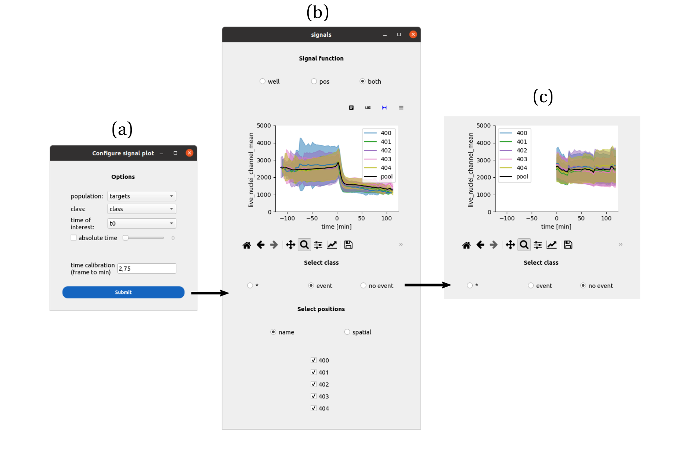
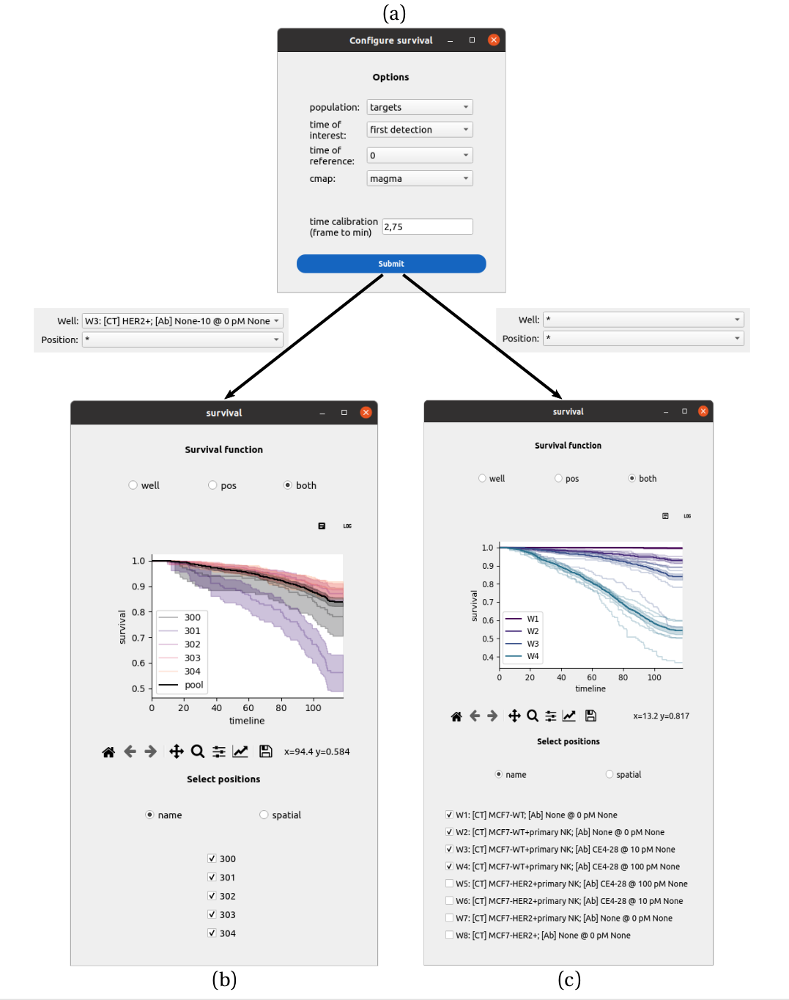

Analysis
========

.. _analysis:

Mean signal response
--------------------

Go to the ``Analyze`` tab, click on the ``plot signals`` button. Configure the cell population of interest, set the class to segregate the cells (the naming convention should follow what you annotated or correct in the signal annotator). Set the associated event time. You can also show the signals using an absolute timepoint to synchronize the signals. Click on ``Submit``. A second window asks for the signal of interest. Pick one in the list and validate. 

    
    **An interface to collapse signals with respect to events.** a) The cell population, class to
    segregate the cells and time of the event is set. Upon submission, a second window asks
    to select a single signal among the signals measured for that cell population. The control
    panel header informs about the data selection, between a single position, multiple positions
    and multiple wells. b) In multiple position mode, the mean signal trace (plus or minus the
    standard deviation) is generated for each position, as well as a pool trace pooling cells from
    all positions. The cells can be filtered between the ones that experienced the event (b) and
    the ones that did not (c), affecting the mean traces.

Survival response
-----------------

Configure a survival function
~~~~~~~~~~~~~~~~~~~~~~~~~~~~~

Go to the ``Analyze`` tab and click on the ``plot survival`` button to open the configuration window.

**Configuration**

For a detailed explanation of all fields (including Time Reference options and Query syntax), see the :ref:`Survival Analysis Settings Reference <ref_survival_settings>`.

**Workflow**

1.  **Data Selection**: Choose the population and define the *Start Event* (Time of Reference) and *End Event* (Time of Interest).
2.  **Filter (Optional)**: Apply a query to select a sub-population (e.g., ``TRACK_ID > 10``).
3.  **Submit**: Click **Submit** to generate the Kaplan-Meier curves.

Output
^^^^^^

A new window will appear displaying the Kaplan-Meier survival curves.

* **Multiple Positions**: Shows individual curves for each position (with 95% confidence intervals) and a pooled curve for the well.
* **Multiple Wells**: Shows pooled curves for each well to allow comparison between conditions.

    
    **An interface to represent survival functions at multiple scales.** a) An analysis modules pilots
    the making of survival functions. A cell population of interest is set, a reference time and an
    event time are picked from the list of events available for that population. The control panel
    header informs about the data selection, between a single position, multiple positions and
    multiple wells. b) In multiple-positions mode, each position’s survival function is plotted with
    its 95 % confidence interval, as well as the pooled survival function for the well. Positions
    can be added or removed from the plot. c) In multiple-wells mode, individual positions are
    still shown but without the 95 % confidence interval. Emphasis is put on the pooled survival
    functions that can be compared across wells. As before, wells can be added or removed
    from the plot.

Start exploring data
--------------------

For a detailed guide on how to interact with the data tables, perform calculations, and collapse tracks, please refer to the :ref:`table_exploration` page.

