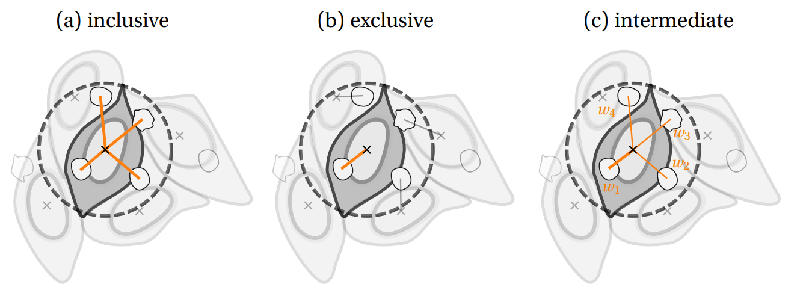

Neighborhood
------------

Reference keys: *neighborhood*, *neighbor counts*

Principle
~~~~~~~~~

Celldetective allows a complete and independent characterization of two cell populations that evolve simultaneously on microscopy images. To study the effect of one population on the other, a preliminary step is to match interacting cells, with a neighborhood scheme. We define a reference cell population and look for the neighboring cells at each timepoint. The neighbor population can be the other cell population (*e.g.*  target-effector reference/neighbor populations) or the same cell population (*e.g.* target-target reference/neighbor populations).

The user can define as many neighborhoods as needed using the two methods described below (isotropic or mask-contact), with as many reference/neighbor population combinations as required.

A neighborhood column with the proper information characterizing the neighborhood method and distance parameters is written in the reference population table. For each cell at each timepoint, the neighboring cells are written in the neighborhood column as a list. This table is exported in the position folder as a pickle file, instead of CSV. On the other hand, the neighbor counts at each timepoint are written directly in the CSV table for further analysis.

Neighborhood methods
~~~~~~~~~~~~~~~~~~~~

**Mask-contact.** If the complete masks for the populations of interest are available, the most natural neighborhood to compute is the direct contact between masks. To build a tolerance when evaluating this contact, we allow a mask dilation before contact evaluation, controlled by a distance parameter :math:`d` in pixels.

**Isotropic.** In the most general case, it is always possible to define an isotropic neighborhood around the center of mass of each object in the system. The only control parameter is the circle's radius :math:`d` in pixels, which determines the largest distance between the center of mass over which two cells can be matched as neighbors.

Counting
~~~~~~~~

Most of the difficulties are encountered in the quantification step, as the isotropic neighborhood rarely reflects the true geometry of the system and is therefore subject to over or underestimation of the real number of neighboring cells. To face these difficulties, we introduced three different counting methods:

#. inclusive: all cells inside the circle are counted as neighbors to the reference cell
#. exclusive: attribute each neighbor to the closest reference cell only
#. intermediate: all cells are counted as neighbors but with a weight (the attention weight) that is :math:`1/M` with :math:`M` the number of neighborhoods the neighbor cell is engaged in

    **Proposed neighborhood counting methods.** Notice the weights attributed in (c).

After neighborhood attribution, the counts are performed, using each of the three techniques described before, and decomposing by the status of the neighbor cells, yielding 9 counting metrics. In addition, the event time of the reference cell information is exploited to measure the mean neighborhood before the event. Therefore, 12 counting metrics are obtained for each neighborhood. The counting metrics are equivalent to the single-cell signals measured before and are written in the CSV tables for further analysis.
