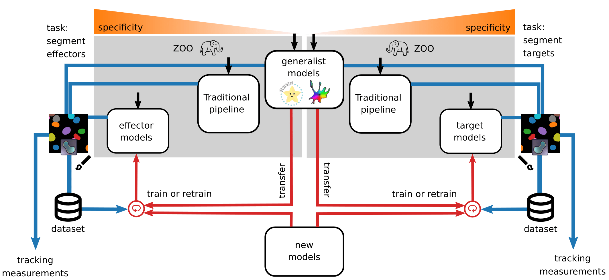

Population-specific segmentation
--------------------------------

The process of instance segmentation takes an image (multichannel or not) as its input and yields a label image (2D), where each segmented object is attributed a single label.

In Celldetective, you may want to specifically segment up to two cell populations of interest on the images (typically target and effector cells but it could be anything). Segmentation can be carried out using traditional segmentation pipelines (based on filters and thresholds) or using Deep-learning models trained for such task. Celldetective proposes both options and allows a cross-talk between the two. As illustrated below, the output of a traditional segmentation can be corrected and used as an input to a DL model directly in Celldetective. That is only one of many paths to perform segmentation in Celldetective.

    **Overview of segmentation options in Celldetective.** Celldetective provides several entry points (black arrows) to perform segmentation, with the intent of segmenting specifically a cell population (left : effectors, right : targets). The masks output from each segmentation technique can be visualized and manually corrected in napari. Exporting these corrections into a paired image and masks dataset can be used either to fit a generalist model (transfer learning) or train one from scratch. Once the segmentation is satisfactory enough, the user can decide to proceed with the tracking and measurement modules.

