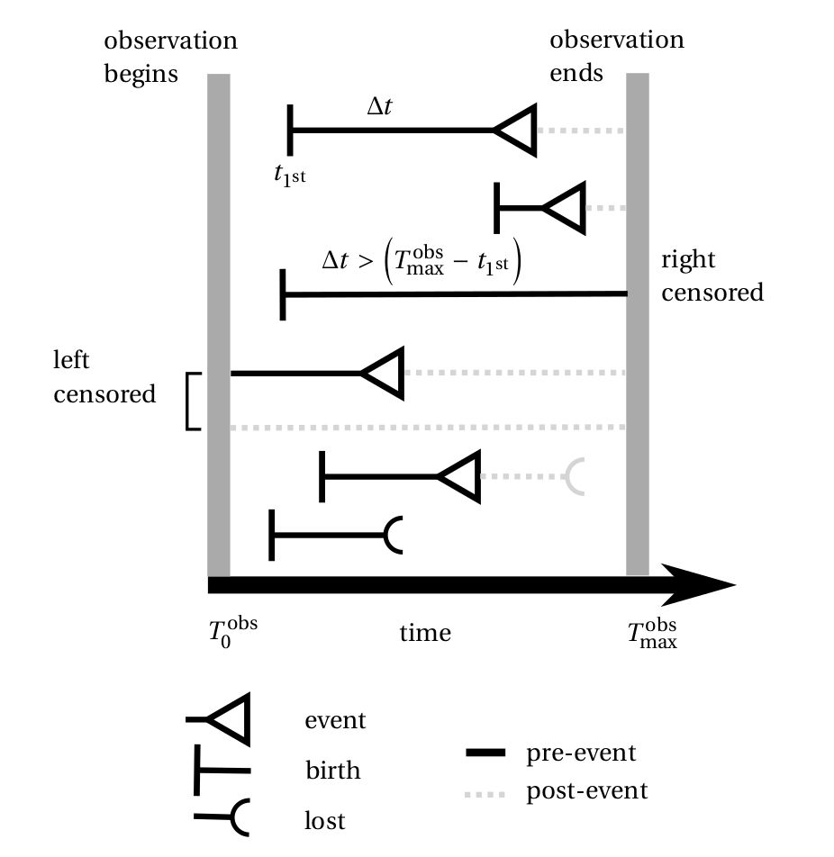

Survival function
=================

**Reference keys:** :term:`survival`, :term:`event`, :term:`event time`, :term:`event class`

The **survival function**, more precisely the Kaplan-Meier estimator, is a practical way to visualize a distribution of event durations :math:`\Delta t_{\textrm{event}}` for a cell population.

It takes two events to define one such duration, the first event acting as a synchronization time for all the cells. A typical reference event could be the appearance of a cell on the image after sedimentation. Say that we are interested in a subsequent event, *e.g.* the cell divides after some time, then in the signal annotator we annotate the absolute time :math:`t_\textrm{division}` at which each cell divides, and use the time of first appearance :math:`t_{1^{\textrm{st}}}` to synchronize the cells in the survival, defining :math:`\Delta t_{\textrm{event}} = t_\textrm{division} - t_{1^{\textrm{st}}}` for each cell.

The rules of left and right censorship still apply, therefore a cell that is already on the image at the start of the observation (left censored) should be discarded using this definition of :math:`\Delta t_{\textrm{event}}` whereas a cell that does not exhibit a division event is right censored and can be fed into the Kaplan-Meier estimator with a duration :math:`T_\textrm{max}^\textrm{obs} - t_{1^{\textrm{st}}}` and labeled as "no event" with :math:`T_\textrm{max}^\textrm{obs}` the maximum observation time (the movie duration). The general rule is that left censored durations are excluded from the Kaplan-Meier estimator, unlike the right censored durations which still provide relevant information, *i.e.* the event has not happened yet in the observed duration.

A notable exception to this rule is when the initial event is an absolute time for all cells (e.g. when the cells or an adverse cell population are seeded on the microscopy plate). If imaging starts shortly after this event, all cells should be left-censored. As an approximation, we can still represent a survival function, by shifting the reference event to :math:`T = 0`. This is particularly relevant in cytotoxicity assays.

    Left and right censorship of single cell events.

