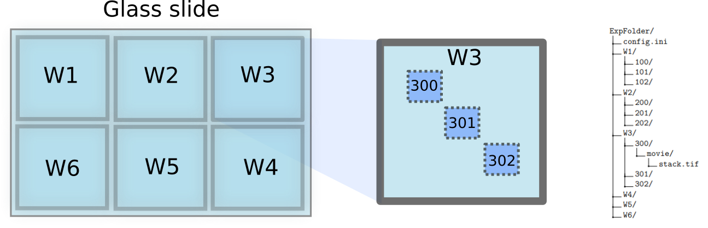

Data organization
=================

.. _data-organization:

Reference keys: *experiment project*, *well*, *position*

We designed a software that structures experimental data into nested well and position folders, mimicking the spatial segregation in a multi-well plate. The well partitioning allows experimentalists to test in parallel multiple biological conditions, such as different cell types, drugs or antibodies at different concentrations, pre-treatments on the cells or surfaces and so on.

    The experiment folder mimics the organization of the glass slide into wells and fields of view within wells.

Since cells are microscopic objects observed under high magnification, capturing all cells within a well in a single image is rarely feasible. Instead, experimentalists typically select multiple imaging positions (or fields of view) within the well, aiming for a representative sample of the entire well.

In Celldetective, single-cell detection is performed independently for each position. The software allows looping through multiple positions or wells, enabling streamlined analysis. Higher-level representations, such as population responses, can aggregate single-cell data from all positions within a well to provide a comprehensive overview.

A **Celldetective experiment** consists of a folder and a configuration file in ``.ini`` format. The folder is organized hierarchically to support data from multiple wells and positions:

#. Experiment folder: Contains individual well folders (one per well) and the configuration file.
#. Well folder: Includes subfolders corresponding to positions within that well.
#. Position folder: Contains a single ``movie/`` subfolder where the user drops the stack associated with that position.

In Celldetective, "processing a movie" is synonymous with processing a position. This approach standardizes workflows and ensures clear data organization.