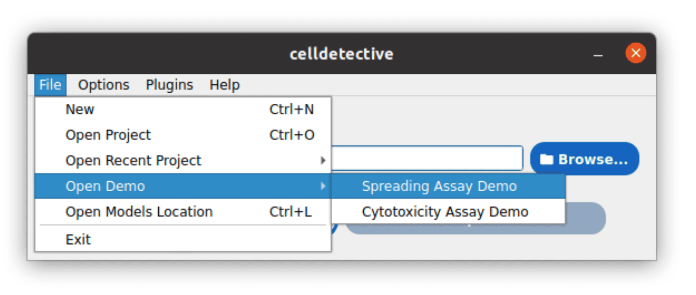
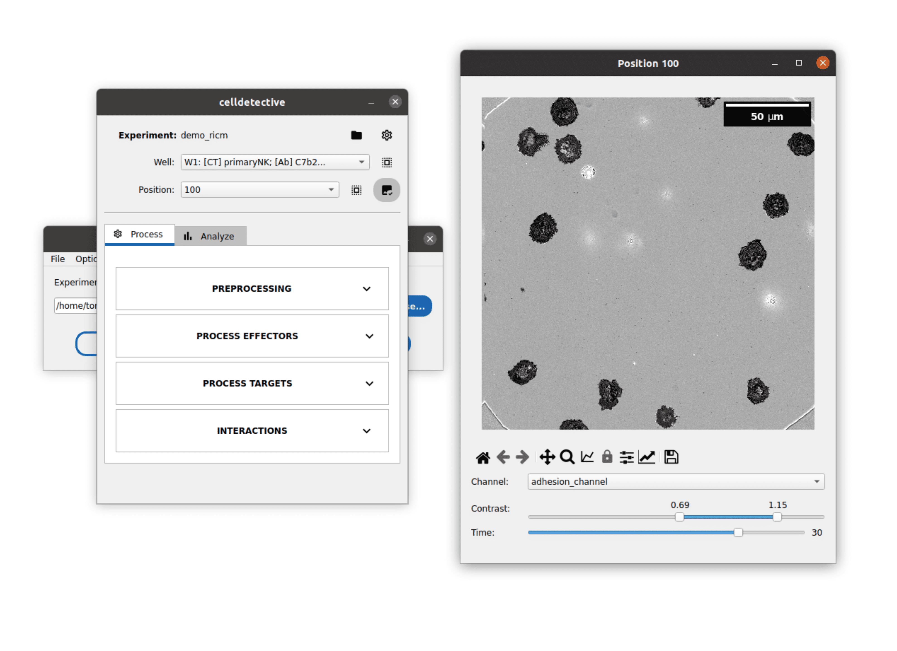
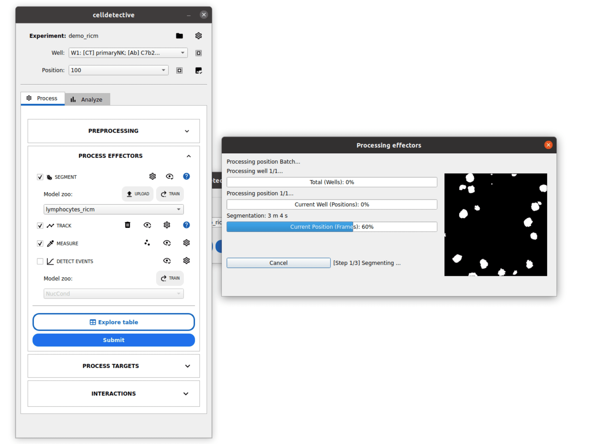
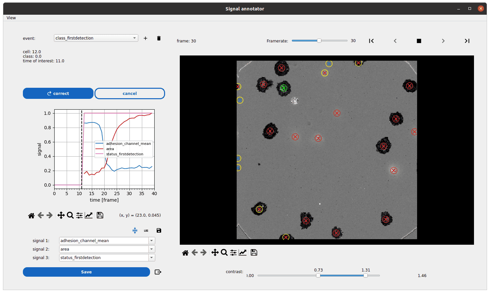
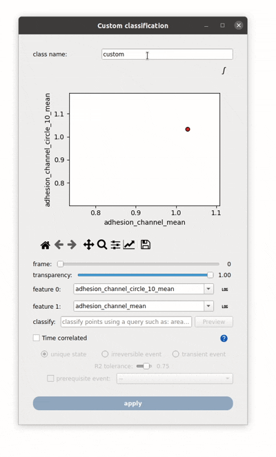
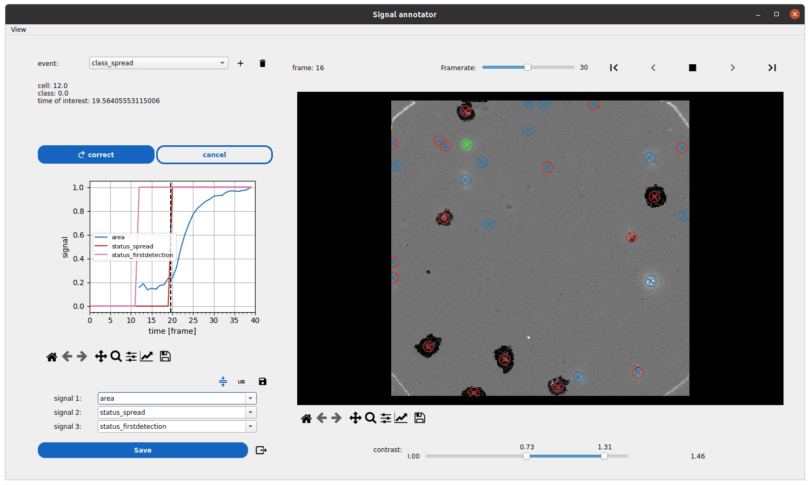
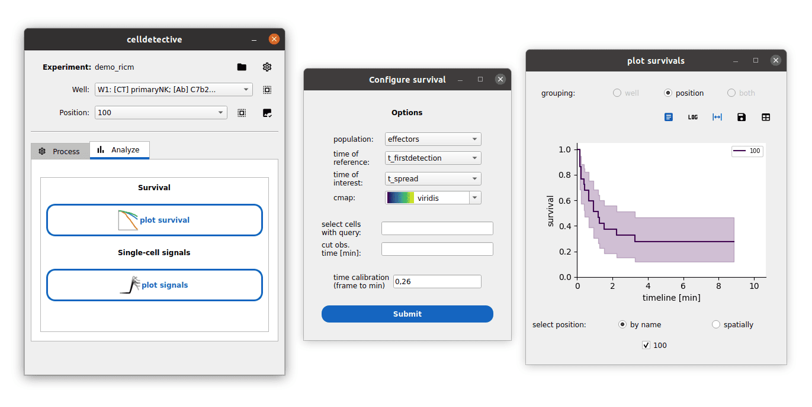
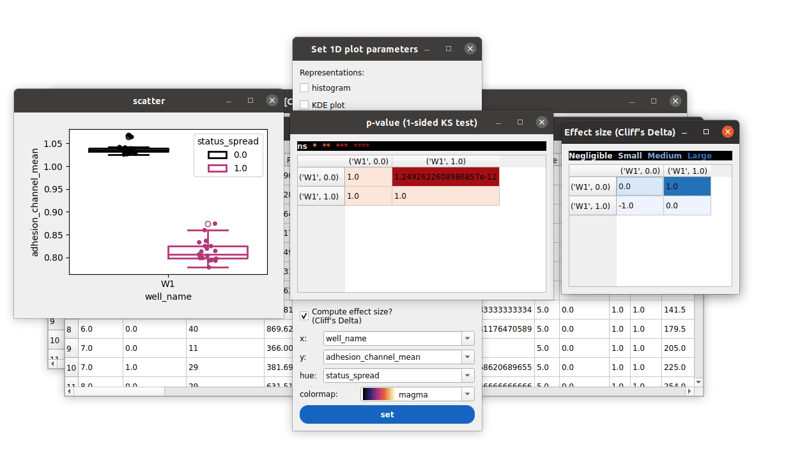

Your First Experiment
=====================

.. _first_experiment:

In this tutorial, you will go through a complete workflow: loading a demo dataset, segmenting cells, tracking them, and visualizing the results.

.. note::
    **Prerequisites**: Ensure you have installed Celldetective following the :doc:`Get Started <get-started>` guide.

Step 1: Get the demo data
-------------------------

We have a built-in shortcut to download a demo dataset (Spreading Assay).

1.  Open your terminal and run:

    .. code-block:: console

        $ python -m celldetective

2.  In the startup window's menu bar, go to **File > Open Demo > Spreading Assay Demo**.

3.  Select a folder where you want to save the data.
4.  The software will download the ``demo_ricm`` dataset and automatically load it.

    Explore the data contained in the Spreading Assay Experiment Demo

Step 2: Segment Cells
---------------------

Now we will detect the cells in the images. The demo dataset contains images of immune cells spreading on a surface mimicking an antigen presenting cell.

1.  Locate the **Process Effectors** block in the processing panel and expand it.
2.  Check the **Segment** box.
3.  In the **Model zoo** dropdown, select **lymphocytes_ricm**.
4.  Click **Submit** to run segmentation.

    The progress windows shows you segmentation masks as they are produced

.. tip::
    You can visualize and correct the segmentation results by clicking the :icon:`eye-outline-check,black` button next to the segmentation entry. This opens napari with the image and mask layers.

Step 3: Track Cells
-------------------

Once cells are segmented for each frame, we can link them over time.

1.  Check the **TRACK** option.
2.  Click the :icon:`cog-outline,black` button next to it.
3.  Select **trackpy** in the tracking options.

.. figure:: _static/tuto_ricm/configure_tracking.png
    :align: center
    :alt: Tracking Settings
    :width: 100%

4.  Press **Save** to close the configuration window and click **Submit**.
5.  The software will link detections frame-by-frame and generate a trajectories table per position (here, only one).

Step 4: Measure Features
------------------------

To analyze cellular dynamics, we need to extract quantitative features.

1.  Check the **MEASURE** option.
2.  Click the :icon:`cog-outline,black` button next to it.
3.  Ensure ``area`` and ``intensity_mean`` are listed in the features list.
4.  Press **Save** to close the configuration window and click **Submit**.
5.  Celldetective will measure these features for every cell at every time point.

Step 5: Analyze Time-Series
---------------------------

This is the core of Celldetective: analyzing how single-cell features change over time.

1.  Scroll to the **DETECT EVENTS** section.
2.  Click the :icon:`eye,black` button (:term:`Event Annotator`) to open the interactive viewer.
3.  **Click on any cell** in the movie (the circle marker will turn green).
4.  The panel on the left displays its feature time-series (e.g., ``area`` vs ``FRAME``).

    Exploring the first detection single-cell event

**Detect Spreading Events**: In this demo, cells become dark (low intensity) when they :term:`spread <spreading event>`. Let's annotate this using the **Classifier Widget**:

1.  In the **MEASURE** section, click the :icon:`scatter-plot,black` button (:term:`Classifier Widget`).

    Condition-based spreading event detection

2.  Set **class name** to ``spreading``.
3.  In the **classify** field, type ``intensity_mean < 1``.
4.  Check **Time correlated** and select **irreversible event**.
5.  Click **apply** to detect this event for all tracks.
6.  Reopen the Event Annotator (Step 5) to see the vertical lines marking the spreading time.

    Exploring the spreading event just computed

Step 6: Explore Results
-----------------------

You can now use dedicated tools to analyze your data:

1.  **Survival Analysis**: Represent the probability of a cell to stay in a hovering state after it appears, over time, using the :doc:`Survival Plot <how-to-guides/basics/plot-survival>` (start event: :term:`first detection <first detection event>`, end event: :term:`spreading <spreading event>`).

    Survival analysis on the spreading assay data

2.  **Table Exploration**: Inspect feature distributions with the :term:`Table Explorer`.

.. figure:: _static/tuto_ricm/table_interactions.gif
    :align: center
    :alt: Exploring the single-cell data
    :width: 100%

    Explore the single-cell data to derive figures

    You can even perform standard statistical analysis on the data

Congratulations! You have successfully processed your first experiment.

Next Steps
----------

*   Learn how to :doc:`create your own experiment <how-to-guides/basics/create-an-experiment>`.
*   Try :doc:`conditional classification <how-to-guides/basics/perform-conditional-cell-classification>` to identify cell states.
*   Explore :doc:`measurement options <measure>`.
