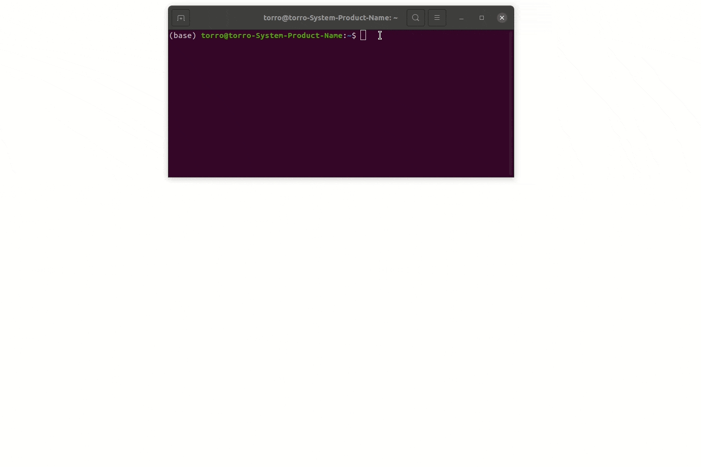
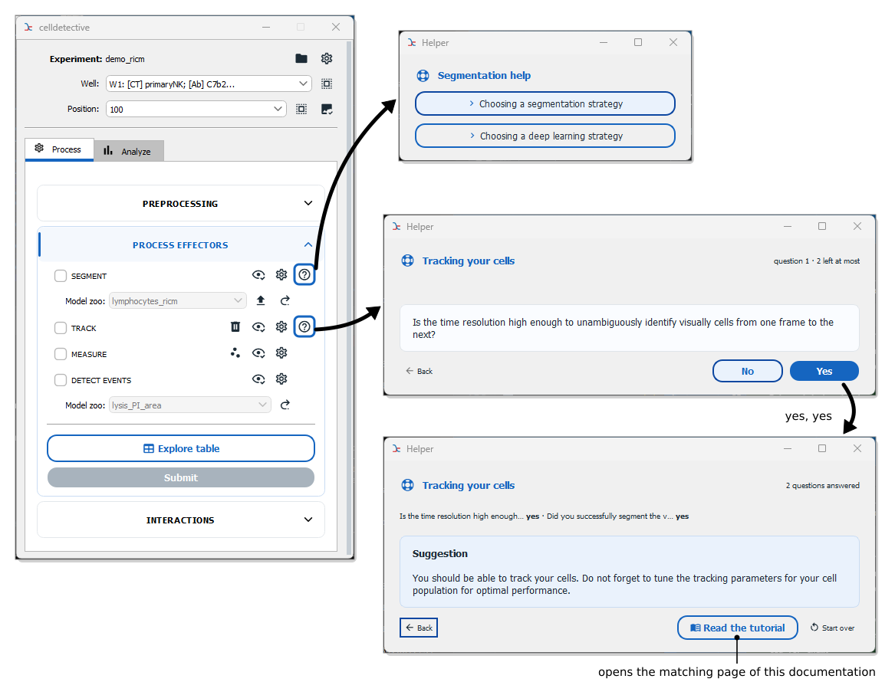

Get started
===========

.. _get_started:

This guide will help you install Celldetective and launch your first session.

Step 1: Installation
--------------------

Celldetective is a Python package typically installed via pip in a conda environment.

.. code-block:: console

    $ pip install celldetective[all]

For detailed instructions, troubleshooting, and GPU setup, see the :doc:`Installation Reference <reference/installation>`.

Step 2: Launching the GUI
-------------------------

Once installed, open a terminal and run:

.. code-block:: console

	$ python -m celldetective

    Launching the software from a terminal.

Step 3: Next Steps
------------------

Upon launch, you can create a new experiment or load an existing one.

*   To understand the experiment structure, see :doc:`First Experiment <first-experiment>`.
*   To create your first project, see :doc:`How to create an experiment <how-to-guides/basics/create-an-experiment>`.

Getting help inside the software
--------------------------------

Several panels carry a :icon:`help-circle-outline,black` button, next to the steps where a choice has to be made: how to structure an experiment, preprocess, segment, track, propagate a classification or compute a neighborhood. It opens a helper that asks a few yes/no questions about your data and ends on a suggestion. The answers stay in view, **Back** changes the last one, and **Read the tutorial** opens the matching page of this documentation.

    **Helpers.** The button of the *SEGMENT* step offers two helpers, one to choose between a threshold pipeline and deep learning, one to choose a deep learning strategy. The button of the *TRACK* step asks whether your cells can be tracked at all.
