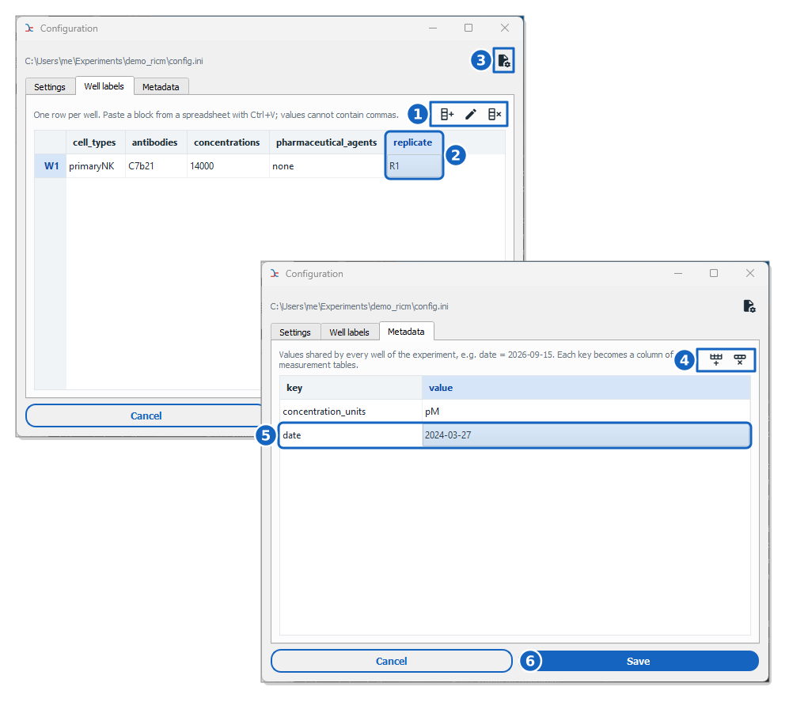

How to inject metadata in the tables?
=====================================

This guide shows you how to inject per-well or global metadata into the single cell tables.

Reference keys: :term:`single-cell measurement`

The metadata live in the experiment configuration file, ``config.ini`` (see :ref:`ref_experiment_config`). Celldetective edits it for you in the **Configuration** window.

    **The configuration editor.** The *Well labels* tab holds one row per well and one column per label; the *Metadata* tab holds the values shared by the whole experiment.

In the *Well labels* tab, the tools of the header add, rename or remove a label (1), and each label is a column holding one value per well (2). In the *Metadata* tab, the tools add or remove an entry (4), and each entry holds a value shared by every well (5). The :icon:`file-cog,black` button opens ``config.ini`` in a text editor instead (3). Nothing is written to the file before **Save** (6).

**Step-by-step:**

#. Open a project.

#. Press the :icon:`cog-outline,black` button of the control panel to open the **Configuration** window.

**Case 1: add a metadata label per well:**

#. Go to the **Well labels** tab.

#. Press the :icon:`table-column-plus-after,black` button and name the new label. Names are stored in lowercase, with underscores instead of spaces.

#. Fill in one value per well. A block of cells copied from a spreadsheet can be pasted with :kbd:`Ctrl+V`. Values cannot contain commas.

The four default labels (``cell_types``, ``antibodies``, ``concentrations`` and ``pharmaceutical_agents``) can be edited but not renamed or removed. A label you added can be renamed (:icon:`pencil,black`) or removed (:icon:`table-column-remove,black`).

**Case 2: add global metadata:**

#. Go to the **Metadata** tab.

#. Press the :icon:`table-row-plus-after,black` button and type a key and its value, e.g. ``date`` and ``2024-03-27``.

Press **Save** (or :kbd:`Ctrl+S`). The configuration is written to ``config.ini`` and reloaded at once in the control panel.

After computing single-cell measurements, you should be able to see these metadata as columns of the tables by pressing the :icon:`table,#1565c0` :blue:`Explore table` button for the population of interest.

.. tip::

    The **Settings** tab gives access to the other sections of the file, such as the movie prefix, the calibration or the channel indices.
