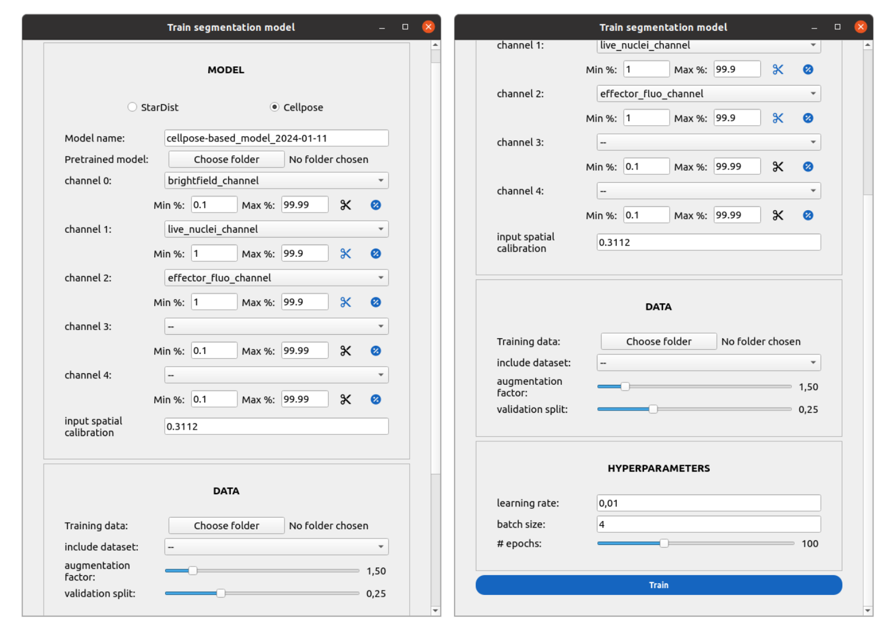

How to train a segmentation model from scratch
==============================================

This guide details the steps to train a custom segmentation model (:term:`StarDist` or :term:`Cellpose`) directly within Celldetective.

.. _prepare-training-data:

Step 1: Prepare your training data
----------------------------------

Before training, you need a set of annotated images.

1.  Open an experiment in Celldetective.
2.  Navigate to the **Segmentation** module.
3.  Load an image and use the **Eye icon** to open it in napari.
4.  Correct the segmentation manually using napari's labels layer.
   
    .. note::
        Ensure every cell in the image is annotated. Missing cells will be treated as background, teaching the model to ignore them.

5.  Click the **Export annotations** button in Celldetective.
    
    This creates a folder named ``annotations_<population>`` in your experiment directory containing the raw images and corresponding label masks.

Step 2: Configure the Model
---------------------------

1.  In the **Segmentation** module, click the **TRAIN** button to open the training window.
2.  **Select Model Architecture:** Choose between :term:`StarDist` (convex objects, nuclei) or :term:`Cellpose` (generalist, irregular shapes).
3.  **Name your model:** Enter a unique name for your new model.
4.  **(Optional) Transfer Learning:** To start from an existing model:

    *   Click **Choose folder** under "Pretrained model".
    *   Select a previously trained model folder (e.g., from `celldetective/models/segmentation_generic`).
    *   This will automatically load the configuration (channels, normalization) of the pretrained model.

Step 3: Configure Data and Channels
-----------------------------------

1.  **Select Training Data:**

    *   Click **Choose folder** in the **DATA** section.
    *   Navigate to and select your ``annotations_<population>`` folder (created in Step 1).
    *   (Optional) You can also mix in built-in datasets by selecting one from the "include dataset" dropdown.

2.  **Set Input Channels:**

    *   Map the channels of your training images to the model inputs.
    *   For :term:`StarDist`: Typically requires one channel (e.g., Nuclei/DAPI).
    *   For :term:`Cellpose`: Can accept up to two channels (e.g., Cytoplasm + Nuclei). Set the second channel to "None" if training on a single channel.

3.  **Define Normalization:**

    *   For each channel, choose a normalization method (Percentile or Min/Max).
    *   **Percentile:** (Recommended) Robust functionality that scales intensities based on image percentiles (e.g., 1st and 99.8th).
    *   **Clip:** Check this to clamp values outside the normalization range.

4.  **Spatial Calibration:**

    *   This field is **auto-filled** with the pixel size (in microns) from your current experiment configuration.
    *   Verify it matches your image resolution (e.g., `0.65`). Training with correct physical sizes ensures better generalization.

Step 4: Adjust Hyperparameters
------------------------------

Micro-tune the training process in the **HYPERPARAMETERS** section:

*   **Augmentation Factor:** Controls how much synthetic data is generated from your original images (rotation, flips, intensity changes). A value of `2.0` doubles your dataset size effectively.
*   **Validation Split:** The fraction of data set aside to test the model's performance during training. Default is `0.2` (20%).
*   **Epochs:** The number of complete passes through the training dataset.

    *   :term:`StarDist`: Defaults around 100-500.
    *   :term:`Cellpose`: Defaults around 100-500 depending on dataset size.
    
*   **Batch Size:** Number of images processed at once. Reduce this if you run out of GPU memory (default: 8).
*   :term:`Learning Rate`: The step size for the optimizer. Defaults are automatically set based on the model type (e.g., `0.0003` for :term:`StarDist`, `0.01` for :term:`Cellpose`), but can be adjusted for fine-tuning.

Step 5: Run Training
--------------------

1.  Click **Train** to start the process.
2.  A progress window will appear, displaying the training loss and validation metrics in real-time.
3.  Once completed, the model is automatically saved to the software's model library and selected in the Segmentation module for immediate use.

    
    **The Segmentation Training Interface.** Overview of the configuration panels for Model selection, Data loading, and Hyperparameter tuning.

