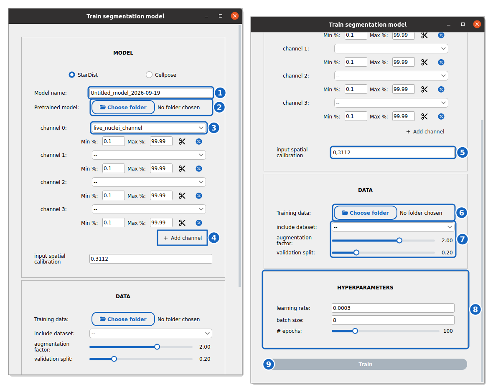

How to train a segmentation model from scratch
==============================================

This guide details the steps to train a custom segmentation model (**StarDist** or **Cellpose**) directly within Celldetective.

.. _prepare-training-data:

Step 1: Prepare your training data
----------------------------------

Before training, you need a set of annotated images.

1.  Open an experiment in Celldetective.
2.  Navigate to the **Segmentation** module.
3.  Load an image and use the **Eye icon** to open it in napari.
4.  Correct the segmentation manually using napari's labels layer.
   
    .. note::
        Ensure every cell in the image is annotated. Missing cells will be treated as background, teaching the model to ignore them.

5.  Click the **Export annotations** button in Celldetective.
    
    This creates a folder named ``annotations_<population>`` in your experiment directory containing the raw images and corresponding label masks.

Step 2: Configure the Model
---------------------------

1.  In the **SEGMENT** row of the population block, click the :icon:`redo-variant,black` button next to the **Model zoo** to open the training window.

    **The segmentation training window.** The MODEL section (left) and, scrolled down, the DATA and HYPERPARAMETERS sections (right), here for a StarDist model of the live nuclei of the ADCC demo.

Name the model (1) and optionally pick a pretrained model to start from (2). Map the channels of the training images to the model inputs (3), adding inputs with **Add channel** (4), and check the spatial calibration (5). Choose the annotation folder (6), optional built-in datasets, the augmentation factor and the validation split (7), then the hyperparameters (8), and press **Train** (9).

2.  **Select Model Architecture:** Choose between **StarDist** (convex objects, nuclei) or **Cellpose** (generalist, irregular shapes).
3.  **Name your model:** Enter a unique name for your new model.
4.  **(Optional) Transfer Learning:** To start from an existing model:

    *   Click **Choose folder** under "Pretrained model".
    *   Select a previously trained model folder (e.g., from `celldetective/models/segmentation_generic`).
    *   This will automatically load the configuration (channels, normalization) of the pretrained model.

Step 3: Configure Data and Channels
-----------------------------------

1.  **Select Training Data:**

    *   Click **Choose folder** in the **DATA** section.
    *   Navigate to and select your ``annotations_<population>`` folder (created in Step 1).
    *   (Optional) You can also mix in built-in datasets by selecting one from the "include dataset" dropdown.

2.  **Set Input Channels:**

    *   Map the channels of your training images to the model inputs.
    *   For **StarDist**: Typically requires one channel (e.g., Nuclei/DAPI).
    *   For **Cellpose**: Can accept up to two channels (e.g., Cytoplasm + Nuclei). Leave the second channel to ``--`` if training on a single channel.

3.  **Define Normalization:**

    *   For each channel, set the **Min %** and **Max %** of the rescaling. :icon:`percent-circle,#1565c0` switches between percentiles (recommended, robust to the intensity range of each image) and absolute values.
    *   :icon:`content-cut,black` clamps the values outside the normalization range.

4.  **Spatial Calibration:**

    *   This field is **auto-filled** with the pixel size (in microns) from your current experiment configuration.
    *   Verify it matches your image resolution (e.g., `0.65`). Training with correct physical sizes ensures better generalization.

Step 4: Adjust Hyperparameters
------------------------------

Two options sit at the bottom of the **DATA** section:

*   **Augmentation factor:** Controls how much synthetic data is generated from your original images (rotation, flips, intensity changes). A value of `2.0` doubles your dataset size effectively.
*   **Validation split:** The fraction of data set aside to test the model's performance during training. Default is `0.2` (20%).

Micro-tune the training process in the **HYPERPARAMETERS** section:

*   **# epochs:** The number of complete passes through the training dataset (default `100`, up to 500 for **StarDist** and 10000 for **Cellpose**).
*   **Batch size:** Number of images processed at once. Reduce this if you run out of GPU memory (default: 8).
*   **Learning rate**: The step size for the optimizer. It is set when you pick the model type (`0.0003` for **StarDist**, `0.01` for **Cellpose**) and can be adjusted for fine-tuning.

Step 5: Run Training
--------------------

1.  Click **Train** to start the process.
2.  A progress window will appear, displaying the training loss and validation metrics in real-time.
3.  Once completed, the model is automatically saved to the software's model library and selected in the Segmentation module for immediate use.
