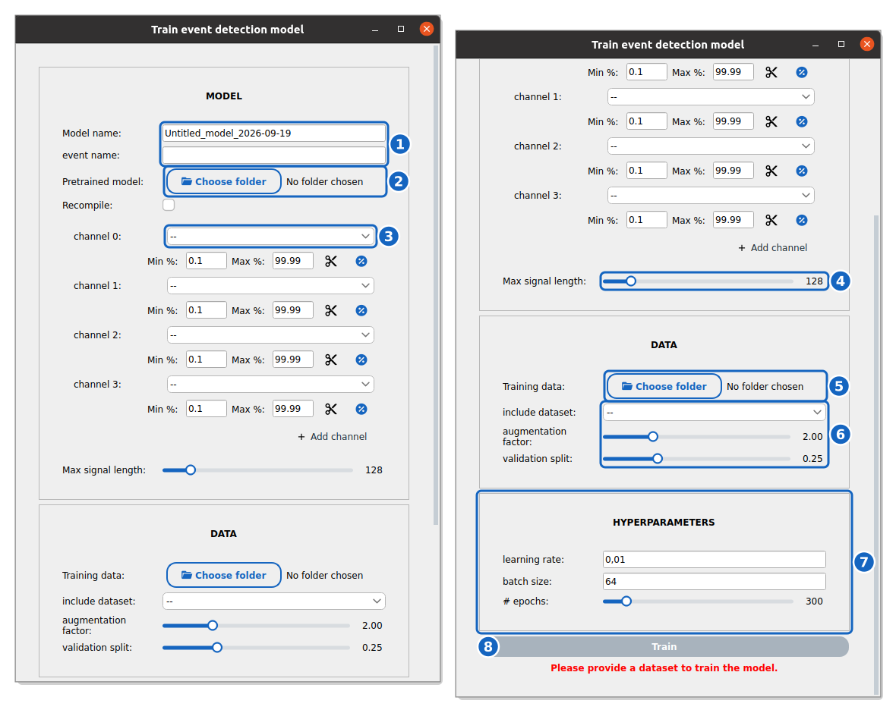
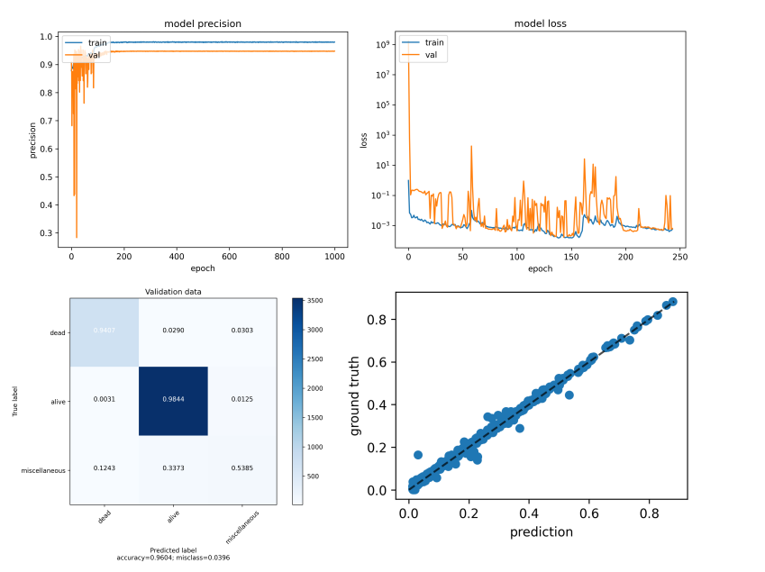

How to train an event detection model from scratch
==================================================

This guide shows you how to train your own event detection model in celldetective, on your data.

Prepare your training data
--------------------------

You can use the signal annotator UI to control and correct single-cell classification and even time estimate with respect to an event. If you are satisfied with the correction, you can export a training set for the event under study, which will be a ``npy`` file containing all single-cell signals of the field of view, a ``class`` attribute and a ``t0`` attribute giving :math:`t_\textrm{event}` . If you store several sets in a folder, you can point towards this folder to train on all sets.

.. note::
    
    Be careful when you handle several events at the same time. The export button will only export the classes and times for the event being monitored when you click on the button

Train a model in the GUI
------------------------

Click the :icon:`redo-variant,black` button next to the **Model zoo** of the **DETECT EVENTS** row. Set a name for the model and describe in one word the event (*e.g.* lysis, division, death...). You can start from a previously trained model or from scratch. Set the channels (*i.e.* single-cell signals of interest), define the normalization procedure. You must set the max signal length: the standardized length of the signals when they enter the model, in frames. Preferably take a value higher than your longest movie. A longer annotated signal is cut to this length for training, and an event annotated past the cut is treated as "no event". At inference, a track longer than the model is scanned with overlapping windows of this length, so the event is still found anywhere along the track.

For the training data, locate the folder where you stored the ``npy`` annotations for the event of interest. You can include datasets among the ones we developed in Zenodo to detect lysis events characterised by a sigmoidal-like increase of the dead nuclei intensity signal ``db-si-NucPI``, or nucleus shrinking characterized by a decreasing nuclear area signal ``db-si-NucCondensation``. 

.. _train-event-models:

    **The event detection training window.** The MODEL section (left) and, scrolled down, the DATA and HYPERPARAMETERS sections (right).

Name the model and the event (1), optionally load a pretrained model (2): it is fine-tuned, unless **Recompile** is ticked, which keeps only its architecture and reinitializes its weights. Set the single-cell signals used as input channels and their normalization (3) and the max signal length (4). Choose the folder of ``.npy`` annotations (5), optional built-in datasets, the augmentation factor and the validation split (6), then the number of epochs, the learning rate and the batch size (7). **Train** (8) is enabled once a dataset is set.

    **Training results.** At the end of the training, the precision and loss curves of the classifier and the regressor, the confusion matrix of the event classes on the validation data and the predicted versus annotated event times help control the quality of the best models. The training can also be followed in detail in TensorBoard.
