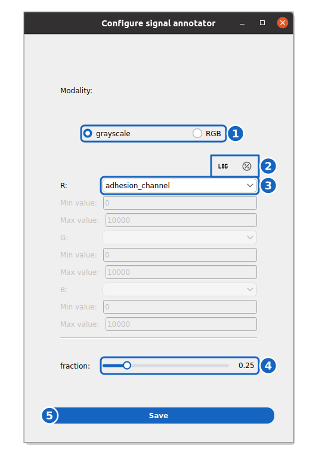

How to annotate an event
------------------------------

This guide shows you how to annotate a single-cell event, either for manual characterisation or to create a dataset to train a deep learning event detection model.

Reference keys: :term:`event`, :term:`event class`, :term:`event time`

**Prerequisite:** You have accurately segmented, **tracked** and measured a cell population of interest. This guide only applies to dynamic data.

Prepare the viewer
~~~~~~~~~~~~~~~~~~

    **Event annotator settings.** The display settings of the event annotator, opened from the DETECT EVENTS row.

#. Go to the DETECT EVENTS section for the cell population of interest. Click on the :icon:`cog-outline,black` button to set up the viewer.

#. Set the modality to "grayscale" (1), or "RGB" to overlay up to three channels.

#. Set the channel of interest (3) and its display range, in intensity values by default; :icon:`percent-circle-outline,black` switches to percentiles and :icon:`math-log,black` to a log scale (2).

#. Adapt the **fraction** value to your data (e.g. 0.25) (4): the images are downscaled by this factor when the viewer loads the movie. At a fraction of 1, you will see the original image (but the viewer will take longer to open and may be slow).

#. Press :blue:`Save` (5) and close the window.

Annotate in the viewer
~~~~~~~~~~~~~~~~~~~~~~

#. Press the :icon:`eye-check-outline,black` button of the DETECT EVENTS section to open the event viewer. Adjust the playback speed with the **Framerate** slider (in frames per second) and press :kbd:`Space` to play or pause the movie.

   .. figure:: ../../_static/signal-annotator.gif
       :width: 100%
       :align: center
       :alt: The event annotator in use

       **The event annotator.** The movie shows the cell centroids marked by their current event status; clicking a cell reveals its signal trace (ADCC demo).

#. Adjust the image contrast.

#. On the top-left side, create a new event by pressing the :icon:`plus,black` button.

#. Give the event a name and set the initialization class to "no event".

#. Click on a single cell to modify its event class.

#. Press :icon:`redo-variant,black` **correct** on the left side to change the class. Choose a class among "event", "no event", "else" and "remove". If you pick "event", determine the exact time (in frame unit) at which the event occurs. Use the time-series of the single cell to observe inflexion points and determine precisely this time.

#. Click on :icon:`redo-variant,black` **submit**, a vertical line will show you the event time on the time series.

#. Proceed to annotate all single-cells with the proper class.

#. Press the :icon:`export,black` button at the bottom of the left side to export a time-series dataset (in ``.npy`` format). Put the file in a folder containing all of your annotations specific to this event.

#. Press the Save button to update the position table with the new event class and the values for each cell.

Viewer Controls & Shortcuts
~~~~~~~~~~~~~~~~~~~~~~~~~~~

The Event Annotator provides controls to play animation, jump between frames, and quickly annotate cells using keyboard shortcuts.

For a complete list of shortcuts (e.g., ``Space`` to play, ``n`` for no-event), see the :ref:`Signal Annotator Shortcuts <ref_signal_annotator_shortcuts>`.

Interactive Correction
~~~~~~~~~~~~~~~~~~~~~~

For efficiently refining annotations, you can use the **Interactive Plotter** to visualize and correct multiple events simultaneously based on their signal traces.

#. **Open the Plotter**: While the Event Annotator is open, press ``Ctrl+P`` or select **View > Interactive Plotter** from the menu.

#. **Visualize Signals**: The viewer displays the signal traces for all loaded tracks, centered on their annotated event time (t=0). You can change the displayed signal using the dropdown menu.

#. **Select Tracks**: Click and drag to draw a box around traces of interest. Selected traces will be highlighted in **red**.

#. **Shift Event Time**: Use the **Left** and **Right Arrow keys** to shift the event time (t0) for the selected tracks. The curves will move horizontally to reflect the new alignment.

#. **Batch Reclassify**: Use the buttons at the top to assign a new class to all selected tracks:
    - **Event**: Confirmed event (Class 0).
    - **No Event**: Reject as noise or non-event (Class 1).
    - **Left-censored/Else**: Ambiguous or other event type (Class 2).
    - **Delete**: Mark for removal.

#. **Save Changes**: Press **Save Changes** in the plotter to save your corrections to the disk. The main Event Annotator window will update to reflect these changes.
