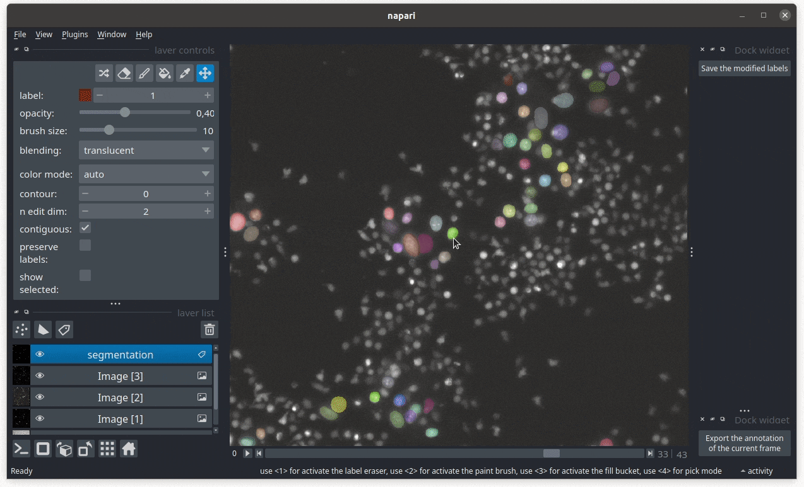

How to annotate a dataset for segmentation
------------------------------------------

This guide shows you how to annotate images to train a segmentation model for the population of interest.

Reference keys: :term:`instance segmentation`, :term:`cell population`

#. Launch the software, load an experiment containing the imaging modaliti(es) and cell population of interest. Expand the single-cell processing block for your population of interest.

#. Recommended: pre-segment the cells you want using either a generic segmentation model (``CP_cyto3``, ``SD_versatile`` for nuclei, see this guide) or with a traditional segmentation pipeline -- see this guide).

#. Click on the :icon:`eye-check,black` button on the right side of the *SEGMENT* option to open the initial masks in napari.

#. In the layer list section, select the channel layer of interest and play with the contrast limits slider to adjust contrast. Activate or deactivate other channels to be able to see your cell population of interest clearly.

#. Use the sliders to find a frame of interest where you would like to annotate. Your dataset should sample everything that can be found in your data, with special emphasis on rare cases.

#. Recommended: press the *New shapes layer* button in the layer list section and the *Add Rectangle* button in the layer controls to draw a crop of a sub-region of the current field of view, limiting the amount of annotations to perform and allowing you to move to another time point to take a different sub-region without spatial repetition. Use the opacity slider to make it as transparent as possible so that cell masks can be annotated properly.

#. Click on the segmentation layer. Use the segmentation layer controls to paint new cells (press :kbd:`M` to increment a new label value), the rubber to erase cells or part of cells. Use the fill bucket with a label value of 0 to erase a cell. Work within the crop region, for the current timepoint only. You can use the time slider to see what happens before/after the current timepoint but the annotation should be done only for the current timepoint.

#. Once the cell masks are as perfect as they can be within the annotated region, press the *Save the modified labels* button to export the annotation. It is written in a *labels_population-name* folder in the current experiment project.

#. Repeat the process for as many regions as possible. Try to sample both spatially and temporally, limiting sub-region repetitions. Once you reach about 10-30 samples, you may attempt to train a deep learning model on your data, with the proper strategy.

.. note::

    Deep learning models struggle with inconsistencies. Performance tends to degrade if annotations conventions are not clearly defined and robust.

    **Exporting a ROI of annotations for segmentation.** In this demo, a false positive cell mask is removed. A rectangular ROI is defined at this given frame, locally to the modification. Upon export, only this crop is exported as a training sample.

