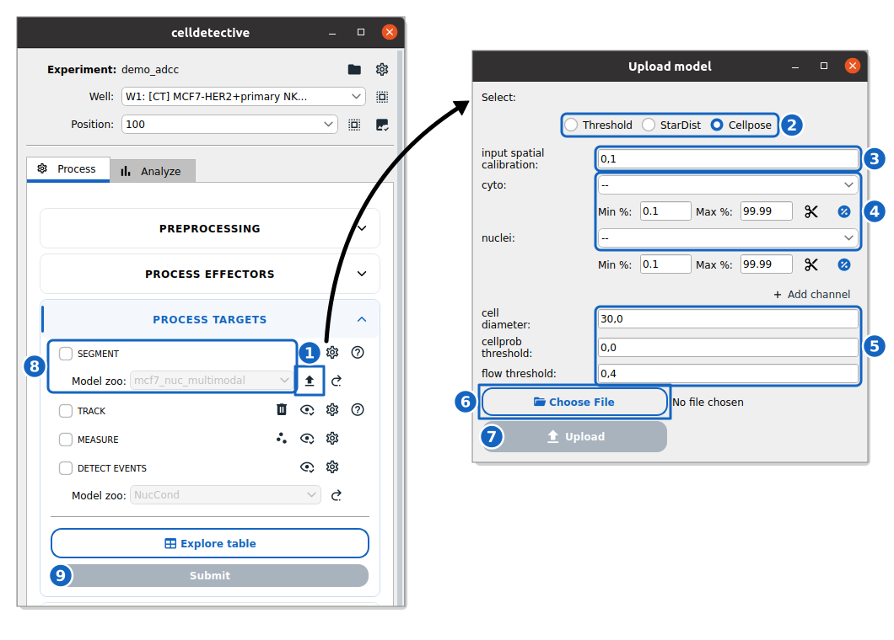

How to apply a segmentation model
----------------------------------

This guide shows you how to import and run a Deep Learning segmentation model (**StarDist** or **Cellpose**) on your data.

Reference keys: :term:`instance segmentation`, :term:`cell population`

Import a model
~~~~~~~~~~~~~~

    **Import and run a segmentation model.** The block of the target population in the ADCC demo and the **Upload model** window, set for a Cellpose model.

#. In the **SEGMENT** row of the population block, click :icon:`upload,black` next to the **Model zoo** (1).

#. Select the model type (**Threshold**, **StarDist** or **Cellpose**) (2).

#. Configure the import settings: the :term:`input spatial calibration` (3), the channels the model expects and their normalization (4) and, for Cellpose, the cell diameter and the two thresholds (5). For a detailed list of all parameters, see the :ref:`Segmentation Data Import Reference <ref_segmentation_settings>`.

#. Click **Choose File** (6) to select your model folder (**StarDist**), file (**Cellpose**) or configuration (``.json``, **Threshold**).

#. Click **Upload** (7) to save the model and its configuration to the project's model zoo.

Run the model
~~~~~~~~~~~~~

#. Tick the **SEGMENT** option in the population block and select your model in the **Model zoo** list (8).

#. Click **Submit** (9) to start processing.

Generalist model configuration
~~~~~~~~~~~~~~~~~~~~~~~~~~~~~~

If you selected a **generalist** model (e.g., ``SD_versatile_fluo``, ``CP_cyto2``), a configuration window appears after clicking **Submit**. You must map your experiment's channels to the model's expected inputs.

For a detailed list of runtime parameters, see the :ref:`Segmentation Runtime Settings Reference <ref_runtime_segmentation_settings>`.

**StarDist** generalist models

*   Select the channel containing the nuclei (e.g., DAPI or Hoechst).

**Cellpose** generalist models

*   **Channel Mapping**: Select the "Cytoplasm" (channel 1) and "Nuclei" (channel 2, optional) channels from your experiment.

*   **Diameter [px]**: The expected cell diameter in pixels.

    *   *Interactive tool*: the :icon:`image-check,black` button next to the diameter field opens the current stack with a red circle of that diameter drawn on it. Adjust the diameter slider until the circle matches your cells, then press **Set** to write the value back. This ensures the model receives images scaled correctly for its training parameters.

*   **Thresholds**:

    *   **Flow threshold**: Controls shape consistency. Maximum error allowed for the flows. Increase (e.g., > 0.4) if cells are missing; decrease to strictly enforce shape constraints.
    *   **Cellprob threshold**: Controls detection sensitivity. Decrease (e.g., < 0.0) to detect fainter or less confident objects.

Image rescaling and normalization are handled automatically based on the internal model configuration.
