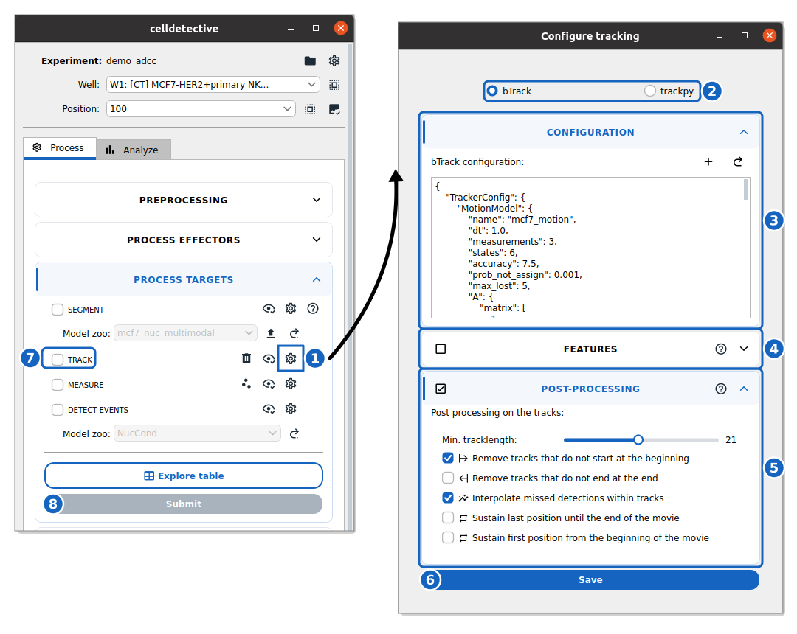

How to configure and run tracking
----------------------------------

This guide shows you how to set up a tracker and run it on your segmented data.

Reference keys: **tracking**, :term:`cell population`

**Prerequisite:** You must have segmented masks for the population of interest.

Configure the tracker
~~~~~~~~~~~~~~~~~~~~~

    **Configure and run tracking.** The block of the target population in the ADCC demo and its tracking settings, with the bTrack configuration of the demo.

#. In the block of your population of interest, click the :icon:`cog-outline,black` button of the **TRACK** row (1) to open the configuration window.

#. **Select a Tracker** (2):

   *   Choose **bTrack** (default) for complex behaviors (division, apoptosis) and crowded scenes. It uses a Bayesian approach with motion prediction; its configuration (3) is a JSON file that you can edit, replace with :icon:`plus,black` (upload a new configuration) or reset with :icon:`arrow-u-right-top,black`.
   *   Choose **trackpy** for simple particle tracking (Brownian motion). Its configuration is a search range (in pixels) and a memory (in frames).

#. **Add Features** (optional, bTrack only): tick the **FEATURES** section (4) to pass morphological (e.g., area) or intensity features to the tracker, which uses them to link the cells. **Haralick** texture features can be added too (computationally expensive).

#. **Configure Post-Processing** (optional): in the **POST-PROCESSING** section (5), filter short tracks, remove tracks that do not start at the beginning or end at the end of the movie, interpolate missed detections, or extend the positions to the whole movie.

#. Click :blue:`Save` (6) to apply your settings.

For a detailed explanation of every parameter, see the :ref:`Tracking Settings Reference <ref_tracking_settings>`.

Run tracking
~~~~~~~~~~~~

#. In the population block, check the **TRACK** box (7).

#. Ensure you have selected the wells/positions you wish to process.

#. Click **Submit** (8).

Celldetective will load the segmentation masks, run the selected tracker, compute the requested features, and save the results as ``trajectories_targets.csv`` (or ``_effectors``) in the ``output/tables`` folder of each position.

Visualize tracks
~~~~~~~~~~~~~~~~

#. Select a single position in the file list.

#. Click the :icon:`eye-check-outline,black` button of the **TRACK** row.

#. Napari will open with the following layers:

   *   ``image``: Raw microscopy data.
   *   ``segmentation``: Labeled cell masks (color-coded by ID).
   *   ``tracks``: Trajectory lines connecting cell positions over time.
   *   ``points``: Centroids of detected cells.
