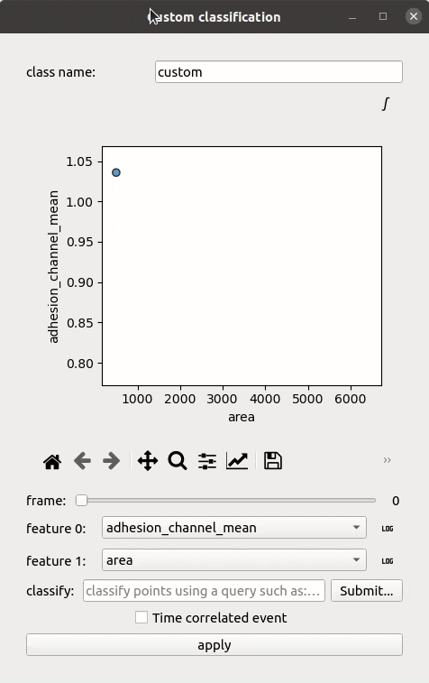

How to detect an event using conditions
---------------------------------------

This guide shows you how to detect time-correlated events (e.g., cell death, spreading) by applying feature-based classification rules that produce a binary signal, which is then fitted with a sigmoid to extract the event time.

Reference keys: *event*, *event class*, *event time*, *threshold-based detection*

**Prerequisite:** You have accurately segmented, **tracked**, and measured a cell population of interest. This guide only applies to dynamic data.

Define the classification rules
~~~~~~~~~~~~~~~~~~~~~~~~~~~~~~~~

#. In the **Measurements** section, click **Classify data**.

#. Enter a name for the event (e.g., ``death``).

#. Project features of interest to identify the transition signal. For example, plot ``PI_intensity_mean`` over time to see when cells become PI-positive.

#. Write the classification condition for the event (e.g., ``PI_intensity_mean > 500``).

#. Check the **Time correlated event** option. This triggers sigmoid fitting on the resulting binary signal.

#. Click **Apply**.

How the sigmoid fitting works
~~~~~~~~~~~~~~~~~~~~~~~~~~~~~~

The classification condition is evaluated at each time point, producing a binary signal per cell:

*   A **completely null** signal → no event detected.
*   A **completely positive** signal → the event occurred before imaging started.
*   A **sigmoid-like switch** → a transition. The time of event is extracted by fitting a sigmoid. An :math:`R^2 > 0.7` validates the fit; otherwise the cell is classified as "else" for manual correction.

    The window to perform a feature-based classification on either static detections or trajectories.

Refine event annotations
~~~~~~~~~~~~~~~~~~~~~~~~~

After automatic detection, use the Event Annotator to verify and correct event times:

.. seealso::
    :doc:`annotate-an-event` for a step-by-step guide on manual event annotation and correction.