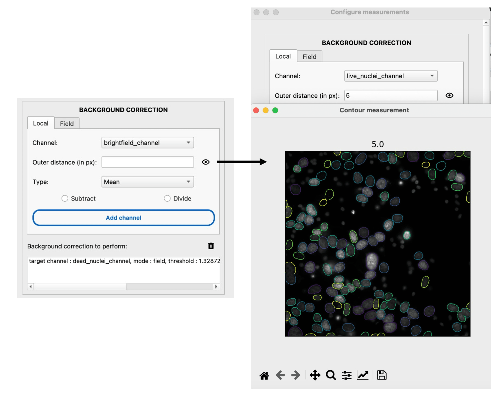

How to measure locally corrected intensities
---------------------------------------------

This guide shows you how to correct single-cell intensity measurements by subtracting or dividing by the local background around each cell.

Reference keys: :term:`local correction`, :term:`single-cell measurement`

**Prerequisite:** You must have segmented the cells. Tracking is recommended but not required.

Enable local background correction
~~~~~~~~~~~~~~~~~~~~~~~~~~~~~~~~~~~~

#. Open the **Measure** tab for your population of interest.

#. In the measurement settings, locate the **Background correction** section.

#. Select the **Local** mode.

Configure the correction
~~~~~~~~~~~~~~~~~~~~~~~~~

#. **Channel**: Select the intensity channel to correct.

#. **Distance**: Set the distance (in pixels) from the cell mask edge to define the background ROI. The background is sampled in a ring around each cell at this distance.

#. **Estimation method**: Choose how to estimate the background intensity within the ROI:

   *   **Mean**: average intensity in the background ring.
   *   **Median**: median intensity (more robust to outliers).

#. **Correction method**: Choose how to apply the correction:

   *   **Subtract**: subtract the estimated background from the cell intensity.
   *   **Divide**: divide the cell intensity by the estimated background.

#. (Optional) Click the **eye icon** to open the background ROI visualizer and verify the ring placement around your cells.

Run the measurements
~~~~~~~~~~~~~~~~~~~~

#. Click **Set** to save the configuration.

#. In the control panel, check the **MEASURE** box and click **Submit**.

The corrected intensity values will be appended to your measurement table with a suffix indicating the correction method and distance.

.. tip::
    Use the ROI visualizer to ensure the background ring does not overlap with neighboring cells. Increase the distance if cells are densely packed.