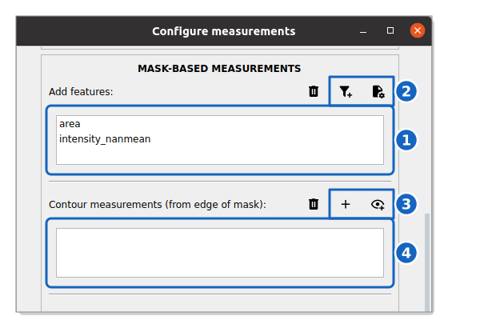

How to measure edge intensity
-----------------------------

This guide shows you how to measure intensity features within specific contour bands relative to the cell boundary (e.g., peripheral or peri-cellular intensity).

Reference keys: :term:`contour measurements`, :term:`single-cell measurement`

**Prerequisite:** You must have segmented the cells. Tracking is recommended but not required.

Enable contour measurements
~~~~~~~~~~~~~~~~~~~~~~~~~~~~

#. In the block of your population of interest, click the :icon:`cog-outline,black` button of the **MEASURE** row to open the measurement settings.

#. Locate **Contour measurements (from edge of mask)** in the **MASK-BASED MEASUREMENTS** section.

    **Mask-based and contour measurements.** The features measured in each mask and the distances of the contour bands.

The contour bands use the intensity features of the **Add features** list (1), completed with :icon:`filter-plus,black` or with your own feature (:icon:`file-cog,black` opens ``extra_properties.py``) (2). They are measured on every channel. The :icon:`plus,black` and :icon:`eye-plus-outline,black` buttons (3) add distances to the list of bands (4).

Configure the contour band
~~~~~~~~~~~~~~~~~~~~~~~~~~~

#. Click :icon:`plus,black` to open the **Set distances** window and set the **Distance [px]** :math:`d`, the offset from the mask edge:

   *   Positive values (:math:`d > 0`) measure **inside** the cell (erosion from the boundary).
   *   Negative values (:math:`d < 0`) measure **outside** the cell (dilation beyond the boundary).

#. To measure a band between two distances, tick **outer distance**: set the **Min distance [px]** and the **Max distance [px]**. For example, ``(0,5)`` measures a 5-pixel-wide ring inside the cell edge.

#. Click **Add**. Alternatively, :icon:`eye-plus-outline,black` opens a viewer on the current position where the band is drawn around each mask as you move the slider; **Add measurement** adds it to the list.

Run the measurements
~~~~~~~~~~~~~~~~~~~~

#. Scroll down and click :blue:`Save` to save the configuration.

#. In the control panel, check the **MEASURE** box and click **Submit**.

The contour intensity features will be appended to your measurement table as ``{channel}_mean_edge_{d}px`` (single distance) or ``{channel}_mean_slice_{d}px`` (range). For example, measuring the mean intensity at distance 3 on a channel named ``GFP`` yields a column ``GFP_mean_edge_3px``.

.. tip::
    Combine a positive and negative distance to measure both inside and outside the cell boundary, which is useful for quantifying membrane-associated signals.