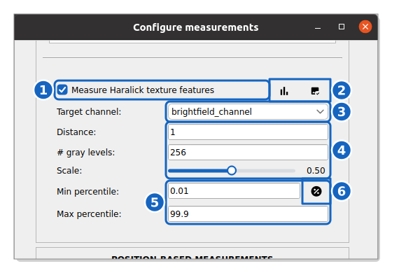

How to measure single-cell texture
-----------------------------------

This guide shows you how to measure **Haralick Texture Features** on a per-cell basis.

Reference keys: :term:`texture features`, :term:`single-cell measurement`

**Prerequisite:** You must have segmented the cells. Tracking is recommended but not required.

Enable **Haralick Texture Features**
~~~~~~~~~~~~~~~~~~~~~~~~~~~~~~~~~~~~~~~~

#. In the block of your population of interest, click the :icon:`cog-outline,black` button of the **MEASURE** row to open the measurement settings.

#. In the **MASK-BASED MEASUREMENTS** section, tick **Measure Haralick texture features**.

Configure the parameters
~~~~~~~~~~~~~~~~~~~~~~~~~

    **Texture options.** The Haralick texture options of the measurement settings.

Once the option is ticked (1), the two buttons on its right (2) help choose the parameters on the current position: :icon:`poll,black` plots the intensity histogram of the target channel, to check which values the normalization clips, and :icon:`image-check,black` shows the image digitized to the chosen number of gray levels.

#. **Target channel**: select the channel to analyze (3), e.g. a DNA channel for chromatin texture.

#. **Distance**, **# gray levels** and **Scale** (4):

   *   **Distance**: the pixel distance for the gray-level co-occurrence matrix computation (default: ``1``). Larger values capture coarser texture patterns.
   *   **# gray levels**: the number of quantized gray-level bins (default: ``256``). Lowering this value (e.g., ``64``) significantly speeds up computation at the cost of intensity resolution.
   *   **Scale**: a downscaling factor between ``0`` and ``1`` to reduce the image size before the computation. Useful for large cells.

#. **Normalization** (5): intensities are clipped before quantization, between a **Min percentile** and a **Max percentile** (e.g., 0.01% – 99.9%). The :icon:`percent-circle,black` button (6) switches to absolute mode, where you set a **Min value** and a **Max value** in intensity units.

Run the measurements
~~~~~~~~~~~~~~~~~~~~

#. Scroll down and click :blue:`Save` to save the configuration.

#. In the control panel, check the **MEASURE** box and click **Submit**.

The following **Haralick Texture Features** will be appended to your measurement table: ``haralick_contrast``, ``haralick_dissimilarity``, ``haralick_homogeneity``, ``haralick_energy``, ``haralick_correlation``, ``haralick_ASM``.

.. note::
    **Haralick Texture Features** are computationally expensive. Consider lowering the gray levels or using a scale factor < 1 for large datasets.