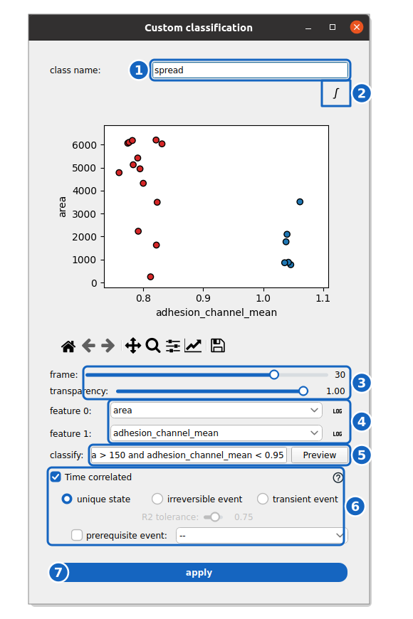

How to perform conditional cell classification
==============================================

This guide shows you how classify cells from their features using conditional expressions.

**Prerequisite:** You have accurately segmented and measured a :term:`cell population`.

**Reference keys:** :term:`characteristic group`, :term:`phenotype`

1. Open an :term:`experiment project`. In the header part, select the :term:`wells <well>` and :term:`positions <position>` you want to classify.

2. Expand the block associated with your :term:`cell population` of interest. Click the :icon:`scatter-plot,black` icon of the **MEASURE** row to launch the classifier.



    **Conditional classification.** The classifier on the effector cells of the spreading demo, at frame 30: the spread cells (large and dark in RICM) match the query and are shown in red.

The window holds the class name (1) and the button projecting all times on the plot (2). The sliders under the plot pick the frame and the transparency of the points (3), the two selectors the features on each axis, with a log toggle each (4). The query is previewed on the plot (5) and the options below (6) make the classification time-correlated. **apply** (7) writes the new columns.

3. Name the classification to create (1). For **dynamic data** this becomes the name of the event. For **static** data, it is the name of the :term:`characteristic group`.

4. Select two features that can clusterize the cells (4), e.g. ``area`` and ``adhesion_channel_mean`` in a spreading classification.

5. **Explore your data:**

    - Use the **frame** slider under the plot to visualize the population feature distribution frame by frame (3).
    - Click :icon:`math-integral,black` to superimpose all timepoints on the same plot (2), useful for checking overall population clusters.
    - Use the :icon:`math-log,black` buttons next to each feature selector to switch between linear and log scales.
    - Adjust the **transparency** slider if points are too dense.

6. **Define the class:**
    Type a condition in the **classify** field (5). The syntax supports numeric comparisons, logic operators, and string matching.

    *   **Numeric conditions:** ``area > 500``, ``intensity < 200``
    *   **Combinations:** ``area > 500 and intensity < 200``, ``area > 500 or circularity > 0.8``
    *   **String/Category matching:** ``well == "W1"``, ``label != "A"`` (use quotes for strings)
    *   **Complex columns:** Use backticks for columns with special characters: ```d/dt.area` > 0``

7. **Preview:**
    Press the **Preview** button.
    
    - **Red points:** Cells matching your condition (Positive).
    - **Blue points:** Cells not matching (Negative).
    
    *Tip: Change the x/y features to verify that your classification makes sense in other dimensions.*

8. **Apply (static vs. time-correlated):**

    - **Static Group (Default):**
      If **Time correlated** is unchecked, clicking **apply** creates a standard **group** or status column. This is a frame-by-frame classification.

    - **Time Correlated Event (For Tracked Data):**
      If your data is tracked (contains ``TRACK_ID``), you can check **Time correlated** (6). This fits a sigmoid to the binary signal of each track to detect *when* an event happens (e.g., cell death, specific state entry).
      
      Select the event type:
      
      *   **Unique state:** The cell enters a state and stays there (or doesn't).
      *   **Irreversible event:** A definitive transition (like death).
      *   **Transient event:** A state that can be entered and exited (e.g., calcium pulse).
      
      *Note: The **R2 tolerance** slider defines how well the sigmoid must fit the data to accept the event time.*

9. Press **apply** (7) to finalize. A new column (e.g., ``status_my_class``) and potentially event times (``t_my_class``) will be added to your data.