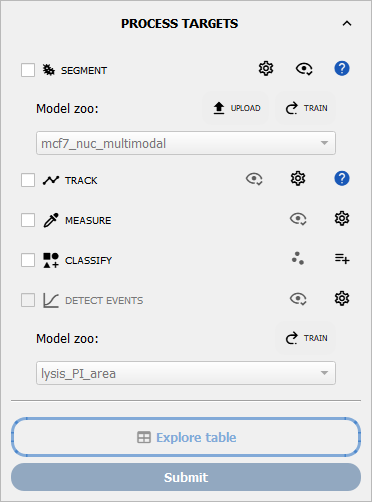

How to perform conditional cell classification
==============================================

This guide shows you how classify cells from their features using conditional expressions.

**Prerequisite:** You have accurately segmented and measured a :term:`cell population`.

**Reference keys:** :term:`characteristic group`, :term:`phenotype`

1. Open an :term:`experiment project`. In the header part, select the :term:`wells <well>` and :term:`positions <position>` you want to classify.

2. Expand the block associated with your :term:`cell population` of interest. In the dedicated **CLASSIFY** section, click the :icon:`scatter-plot,black` button to launch the classifier utility.



    The **CLASSIFY** step in a population block. The :icon:`scatter-plot,black` button opens the classifier, and the :icon:`playlist-plus,black` button imports classification configs to queue for this step (the button text shows how many are queued).

3. Name the classification to create. For **dynamic data** this becomes the name of the event. For **static** data, it is the name of the :term:`group`.

.. note::
    Use **Save config** in the classifier to store a classification as a reusable config. Saved **static** (group) configs are queued under the **CLASSIFY** step and applied in order when you run the block; **time-correlated** configs are routed to the **DETECT EVENTS** step instead.

4. Select two features that can clusterize the cells (e.g. area and adhesion channel intensity in a spreading classification).

5. **Explore Your Data:**
    - Use the **Frame Slider** at the bottom to visualize the population feature distribution frame by frame.
    - Click the **Project Times** button :icon:`math-integral,black` to superimpose all timepoints on the same plot (useful for checking overall population clusters).
    - Use the **Log Scale** buttons :icon:`math-log,black` next to each feature selector to switch between linear and log scales.
    - Adjust the **Transparency Slider** (bottom right) if points are too dense.

6. **Define the Class:**
    Type a condition in the classify field. The syntax supports numeric comparisons, logic operators, and string matching.

    *   **Numeric conditions:** ``area > 500``, ``intensity < 200``
    *   **Combinations:** ``area > 500 and intensity < 200``, ``area > 500 or circularity > 0.8``
    *   **String/Category matching:** ``well == "W1"``, ``label != "A"`` (use quotes for strings)
    *   **Complex columns:** Use backticks for columns with special characters: ```d/dt.area` > 0``

7. **Preview:**
    Press the **Preview** button to evaluate the query without writing anything to your tables.

    - **Red points:** Cells matching your condition (Positive).
    - **Blue points:** Cells not matching (Negative).

    *Tip: Change the x/y features to verify that your classification makes sense in other dimensions.*

8. **Static vs. Time-Correlated:**

    - **Static Group (Default):**
      If **Time correlated** is unchecked, the config produces a standard :term:`group` column. This is a frame-by-frame classification.

    - **Time Correlated Event (For Tracked Data):**
      If your data is tracked (contains ``TRACK_ID``), you can check **Time correlated**. This fits a sigmoid to the binary signal of each track to detect *when* an event happens (e.g., cell death, specific state entry).

      Select the event type:

      *   **Unique state:** The cell enters a state and stays there (or doesn't).
      *   **Irreversible event:** A definitive transition (like death).
      *   **Transient event:** A state that can be entered and exited (e.g., calcium pulse).

      *Note: The **R2 tolerance** slider defines how well the sigmoid must fit the data to accept the event time.*

9. **Save the config and run the step.**
    The classifier is a config *maker*: it has no "Apply" button. Once your **Preview** looks correct, press **Save config**. The saved config is then queued under the **CLASSIFY** step in the population block (the :icon:`playlist-plus,black` button's text shows how many configs are queued).

    To actually write the columns to your tables, tick the **CLASSIFY** checkbox and run the block:

    - **Static Group (Default):** a single column ``group_<name>`` is added (e.g. ``group_my_class``).
    - **Time-Correlated Event:** the config is instead routed to the **DETECT EVENTS** step, which adds the event class, time, and status columns (``class_my_class``, ``t_my_class`` and ``status_my_class``).