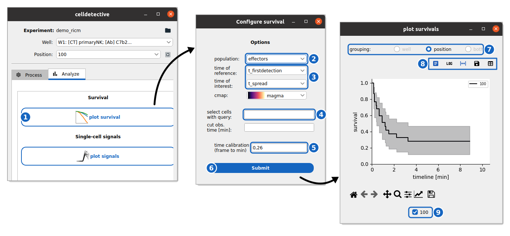

How to plot survival between two events
---------------------------------------

This guide shows you how to generate Kaplan-Meier survival curves between two annotated events.

Reference keys: :term:`survival`, :term:`event time`

**Prerequisite:** You have segmented, tracked, measured, and annotated events for a cell population. At least two events must be defined (a start reference and an end event).

Configure the survival plot
~~~~~~~~~~~~~~~~~~~~~~~~~~~~~

    **Survival between two events.** The time from the first detection of each effector cell to its spreading, in the spreading demo.

#. Go to the **Analyze** tab and click **plot survival** (1).

#. Select the **population** of interest (2).

#. Set the **time of reference** — the event that marks the beginning of the observation window (e.g., ``t_firstdetection``) — and the **time of interest** — the event whose occurrence you want to measure (e.g., ``t_spread``) (3).

#. (Optional) Enter a query in **select cells with query** to filter the population (e.g., ``TRACK_ID > 10`` or ``treatment == "drug_A"``) (4), and a **cut obs. time [min]** to stop the observation at a given time.

#. Check the **time calibration** (frame to min) (5).

#. Click **Submit** (6).

For a full description of all fields, see the :ref:`Survival Analysis Settings Reference <ref_survival_settings>`.

Interpret the output
~~~~~~~~~~~~~~~~~~~~~

A window appears with the Kaplan-Meier survival curves.

*   **Single position**: A single survival curve for the selected position.
*   **Multiple positions**: Individual curves per position (with 95% confidence intervals) and a pooled curve for the well.
*   **Multiple wells**: Pooled curves per well for comparing conditions. Individual positions are shown without confidence intervals.

Switch the **grouping** between wells, positions or both (7). The buttons above the plot (8) toggle the legend, the log scale and the confidence intervals, export the figure and tabulate the survival values. Add or remove positions/wells from the plot with their checkboxes (9).