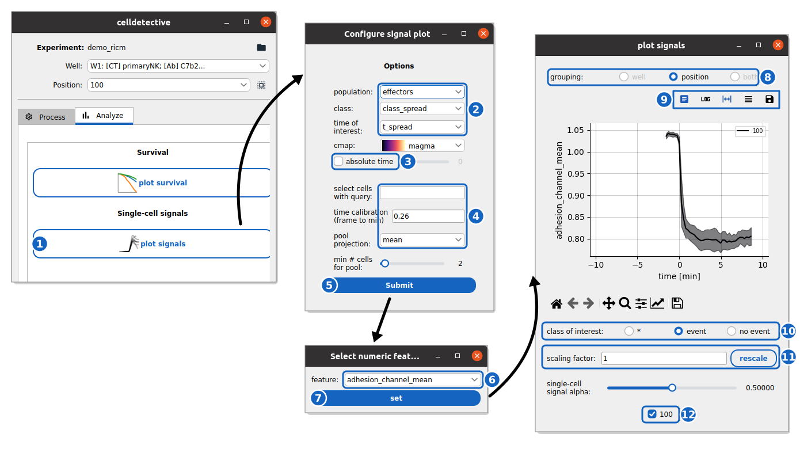

How to synchronize single-cell timeseries over a population
-----------------------------------------------------------

This guide shows you how to collapse single-cell signal traces into population-averaged time series, aligned to a reference event time.

Reference keys: **mean signal**, **signal response**, **population average**

**Prerequisite:** You have segmented, tracked, measured, and annotated events for a cell population.

Step 1: Configure the signal plot
~~~~~~~~~~~~~~~~~~~~~~~~~~~~~~~~~~

    **Synchronized signals.** The mean RICM intensity of the effector cells of the spreading demo, aligned on their spreading time.

#. Go to the **Analyze** tab and click **plot signals** (1).

#. In the **Options** window, configure the following:

    *   **population**: The cell population (or pair) to analyze (2).
    *   **class**: The column used to segregate cells (e.g., ``class_spread``). This determines the "event" vs "no event" grouping.
    *   **time of interest**: The event time column (e.g., ``t_spread``) used to align the traces (t=0).
    *   **cmap**: (Optional) Select a colormap for the curves.
    *   **absolute time**: Check this to ignore the event time and synchronize signals using an absolute frame number (set via the slider) (3).
    *   **select cells with query**: (Optional) Enter a pandas query to filter cells (e.g., ``TRACK_ID > 10``) (4).
    *   **time calibration (frame to min)**: Frame-to-minute conversion factor.
    *   **pool projection**: Choose how to aggregate the population (``mean`` or ``median``).
    *   **min # cells for pool**: Minimum number of cells required to calculate a valid data point.

#. Click **Submit** (5).

Step 2: Select the signal
~~~~~~~~~~~~~~~~~~~~~~~~~

#. A second window appears ("Select numeric feature").

#. Select the measurement you want to plot (e.g., ``adhesion_channel_mean``) (6).

#. Click **set** (7).

Step 3: Interact with the plot
~~~~~~~~~~~~~~~~~~~~~~~~~~~~~~

The plot window displays the synchronized signals. You can interact with it using the controls:

*   **Grouping** (8): Switch between **well** (pooled per well), **position** (per position), or **both**.

*   **Toolbar Buttons** (9):

    *   **Legend**: Toggle legend visibility.
    *   **Log**: Toggle log-scale for Y-axis.
    *   **CI**: Toggle 95% confidence intervals.
    *   **Cell lines**: Toggle display of individual single-cell traces.
    *   **Export**: Save the figure or export tabular data.

*   **Class of interest** (10): Filter the displayed curves by class:

    *   ``*``: Show all cells.
    *   ``event``: Show only cells belonging to the event class (class 0).
    *   ``no event``: Show only cells belonging to the non-event class (class 1).
    
*   **Rescale** (11): Set a **scaling factor** for the Y-axis and press **rescale**.
*   **Single-cell signal alpha**: Adjust the transparency of individual cell traces.
*   **Select position** (12): Choose which positions/wells to display, either **by name** (checkboxes) or **spatially** (clicking on the position map).