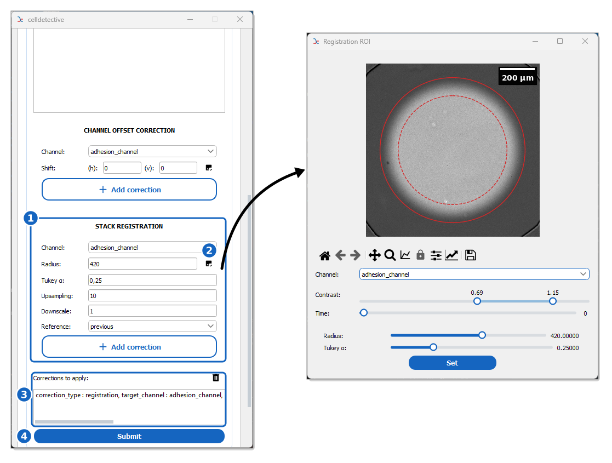

How to register stacks
======================

This guide shows you how to correct the drift of your movies (registration) directly in Celldetective, so that a cell that does not move stays at the same pixel from one frame to the next.

Reference keys: :term:`preprocessing`, :term:`alignment`

**Prerequisite:** an experiment with at least one position (see :doc:`create-an-experiment`).

Overview
--------

The drift is estimated on one channel, the registration channel, by Fourier phase cross-correlation between frames, with sub-pixel precision. The same translation is then applied to every channel of the frame. Registration only corrects translations: a rotation or a deformation of the field is not corrected.

    **Stack registration.** The correlation is computed inside the solid circle, and the image is smoothly faded to zero between the dashed and the solid circle, so that the field edges do not drive the result.

The registration options sit at the bottom of the **PREPROCESSING** block (1). The :icon:`image-check,black` button opens a frame of the current position to set the correlation disk (2). The correction is then added to the list of corrections (3), which **Submit** applies to the selected positions (4).

Set up the registration
-----------------------

#. Launch the software and open a project.

#. Expand the **PREPROCESSING** block and scroll down to **STACK REGISTRATION**.

#. Select the registration **Channel**: a channel with stable, contrasted structures, present on every frame (e.g. brightfield, RICM or a nuclear stain). The drift estimated on this channel is applied to all the others.

#. Click on the :icon:`image-check,black` button next to **Radius** to open a frame of the current position. Set the **Radius** so that the disk covers the structures that should stay still, and leaves out what should not drive the correlation: the dark corners of a vignetted field, the rim of a well, dust. Tune the **Tukey α** slider, the fraction of the disk faded to zero at its edge. Press **Set** to send the radius back to the options. Leave the radius empty to use the full frame.

#. Set the remaining options if needed (see :ref:`the reference <ref_preprocessing_settings>`):

   *   **Upsampling**: the shift is measured to 1/*upsampling* of a pixel (default ``10``).
   *   **Downscale**: estimate the drift on a reduced image (block averaging), which is faster on large frames. The shift is applied at full resolution (default ``1``, no downscaling).
   *   **Reference**: ``previous`` correlates each frame with the one before and adds up the shifts, which follows slow changes of the sample; ``first`` correlates every frame with the first one, which does not accumulate errors but fails when the field changes a lot over the movie.

#. Press :icon:`plus,#1565c0` :blue:`Add correction`. The registration is added to the list of corrections to apply.

Apply the registration
----------------------

#. Select the positions to register with the well and position dropdowns of the control panel.

#. Press **Submit**. The corrections of the list are applied in order to each selected position.

#. The registered stack is written in the ``movie/`` folder of each position with the prefix ``Corrected_``, next to a ``Corrected_<movie>_registration_shifts.csv`` table holding the shift of each frame (``FRAME``, ``SHIFT_Y``, ``SHIFT_X``, in pixels). The step and its parameters are recorded in the position's ``log_preprocessing.txt``.

#. Change the movie prefix of the experiment to ``Corrected`` (press the :icon:`cog-outline,black` button of the control panel, see :doc:`../advanced/inject-metadata`) so that segmentation and the other steps read the registered stacks.

.. note::

    Pixels that a shift brings in from outside the field of view are set to ``0``, so the registered frames show black bands on the side opposite to the drift.

.. tip::

    Several corrections can be chained: the first one reads the raw movie and writes the ``Corrected_`` stack, the next ones correct that stack in place. Put the background corrections **before** the registration: the illumination pattern is fixed to the camera, not to the sample, so it has to be estimated on frames that have not been moved yet.

.. seealso::

    :doc:`register-stacks-with-fiji` to register the stacks before importing them, with a Fiji macro. It can correct rigid motions (translation and rotation).
