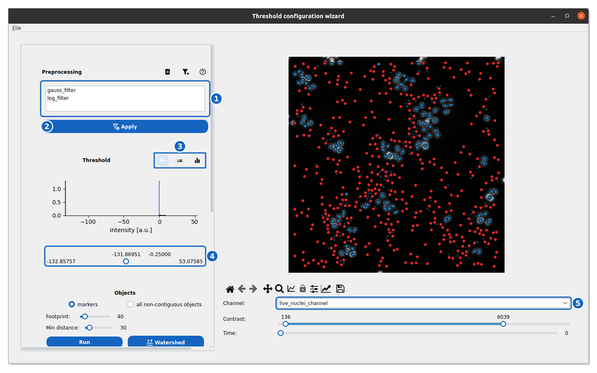
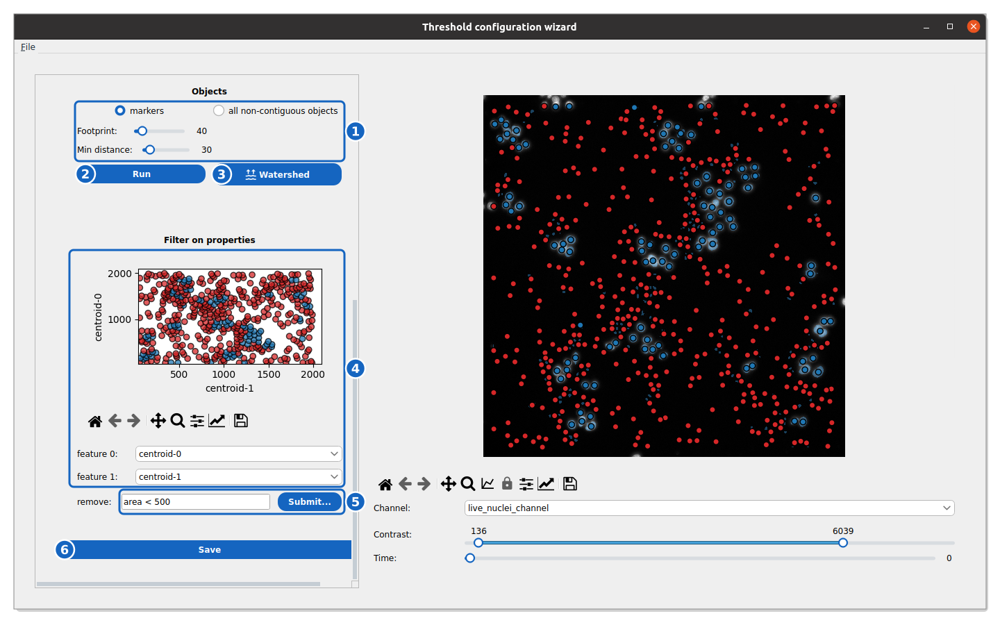

How to segment with the Threshold Configuration Wizard
-------------------------------------------------------

This guide shows you how to build a traditional segmentation pipeline interactively using filters, thresholds, and morphological operations — without a Deep Learning model.

Reference keys: :term:`instance segmentation`, :term:`cell population`

Open the Threshold Configuration Wizard
~~~~~~~~~~~~~~~~~~~~~~~~~~~~~~~~~~~~~~~~

#. Select a specific position within your experiment.

#. In the **Segmentation** section of the Control Panel, locate the population of interest (e.g., Targets or Effectors).

#. Click the :icon:`upload,black` button.

#. Toggle the **Threshold** option.

#. Click the **Threshold Config Wizard** button to open the interface.

The wizard opens on the first frame of the current position, with the image on the right and the pipeline on the left, from top to bottom.

    **Preprocessing and threshold.** The wizard on the live nuclei of the ADCC demo, with the pipeline of the demo's own configuration: a Gaussian and a LoG filter, then a threshold.

The filters (1) are applied to the image with **Apply** (2). The buttons of the **Threshold** section (3) fill the holes of the binary mask, switch the histogram to a log scale and match the histogram of each frame to a reference frame. The threshold is the range of the slider under the histogram (4); the channel is chosen under the image (5).

Step 1: Preprocessing
~~~~~~~~~~~~~~~~~~~~~

Enhance the image to make objects easier to detect.

*   **Add Filter:** Click :icon:`filter-plus,black`, select a filter (e.g., ``gauss``, ``median``, ``std``) and its kernel size, then click **Add**.
*   **Remove Filter:** Select a filter in the list and click :icon:`delete,black`.
*   **Apply:** Click **Apply** to see the effect on the image.
*   **Help:** :icon:`help-circle,black` asks a few questions about your images and suggests filters.

Step 2: Thresholding
~~~~~~~~~~~~~~~~~~~~

Binarize the image to separate foreground (cells) from background.

*   **Slider:** Adjust the min/max handles to define the intensity range kept as foreground.
*   **Histogram:** Use the histogram of the filtered image to identify intensity peaks. Toggle :icon:`math-log,black` for better visibility of rare values.
*   **Fill Holes:** :icon:`format-color-fill,black`, on by default, fills the holes inside detected objects.
*   **Histogram matching:** :icon:`equalizer,black` matches the histogram of every frame to the current one before thresholding, for movies whose intensity drifts.

Step 3: Object Detection (Split / Merge)
~~~~~~~~~~~~~~~~~~~~~~~~~~~~~~~~~~~~~~~~

Convert the binary mask into individual objects.

    **Objects and property filter.** The lower part of the wizard: markers, watershed, and the filter on the properties of the objects.

The object options (1) set how the mask is split; **Run** (2) detects the markers and **Watershed** (3) grows them into objects. The scatter plot and its two feature selectors (4) show the properties of the objects, the query (5) removes those that match it, and **Save** (6) writes the configuration.

**Option A: Markers (Watershed)**
Best for touching cells or nuclei.

*   **Footprint:** Adjust the size of the local region used to find distinct peaks. Larger values merge peaks; smaller values split them.
*   **Min distance:** Set the minimum allowed distance between two object centers.
*   **Run:** Click **Run** to detect markers (shown as red dots).
*   **Watershed:** Click **Watershed** to expand markers into object boundaries.

**Option B: All Objects**
Best for well-separated objects.

*   **Select:** Choose **all non-contiguous objects**.
*   **Watershed:** Click **Watershed** to label all connected components directly.

Step 4: Property Filtering
~~~~~~~~~~~~~~~~~~~~~~~~~~

Remove false positives based on morphology or intensity.

*   **Visualize:** Use the **feature 0** and **feature 1** dropdowns to plot two properties (e.g., ``area`` vs ``solidity``) on the scatter plot.
*   **Query:** In the **remove** field, enter a query matching the objects to remove (e.g., ``area < 100`` or ``solidity < 0.9``).
*   **Filter:** Click **Submit...**: the matching objects turn red in the scatter plot and are removed from the segmentation.

Save and apply the pipeline
~~~~~~~~~~~~~~~~~~~~~~~~~~~

#. Click **Save** and choose where to write the ``.json`` configuration (by default ``configs/threshold_config_<population>.json`` in your experiment).

#. The wizard closes, and the configuration file is loaded into the **Upload model** window.

#. Click **Upload** to confirm.

#. To process the entire position or experiment, select **Threshold** in the segmentation zoo and click **Submit**.

Merging Multiple Configurations
~~~~~~~~~~~~~~~~~~~~~~~~~~~~~~~

In some cases, a single thresholding pipeline may not be sufficient to capture all variations of a cell population. You can merge multiple configurations together to create a more robust union mask:

#. In the **Upload Model** window, click **Choose File** for the Threshold option.
#. Select **multiple** ``.json`` threshold configuration files (using ``Ctrl+Click`` or ``Shift+Click``).
#. A **Merging option** dropdown will appear. Currently, the supported method is **OR**, which computes the logical union of the objects detected by all the selected pipelines.
#. Click **Upload**. When you run the segmentation task, Celldetective will process the images through each pipeline and merge the resulting masks.

.. note::

    The **OR** union is not just a simple pixel-wise mathematical OR. The merging is performed at the object instance level:
    
    * It compares the segmented objects from the first pipeline against objects from the second pipeline.
    * Matches between conflicting cell instances are established using the Intersection over Union (IoU) metric. If the IoU between two objects is above a threshold (currently fixed via the Stardist `matching` function at 0.5, with an internal matching verification at 0.05), the objects are considered to be the same cell mask.
    * The pixels belonging to matched objects are then combined together via a logical OR union.
    * If an object from the second pipeline has no match in the first pipeline (IoU < 0.5), it is added as a completely new individual cell instance in the final merged output.

.. note::

    You must reload the threshold config file if you reopen the experiment later.
