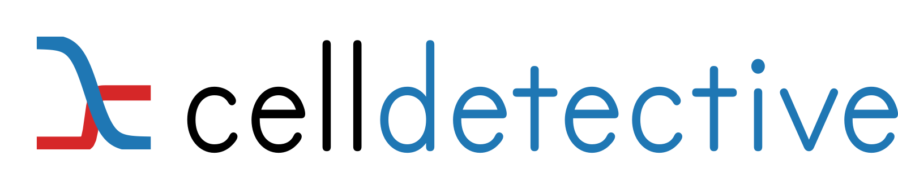

Celldetective, a bioimage analysis software
===========================================

Celldetective offers both a **Python API** and a **Graphical User Interface (GUI)** to perform single-cell analysis on multimodal time-lapse microscopy images.

- `Check the source code <https://github.com/remyeltorro/celldetective>`_
- `Report a bug or request a new feature <https://github.com/remyeltorro/celldetective/issues/new/choose>`_
- `Explore the datasets models and demos <https://zenodo.org/records/10650279>`_

Check the :doc:`overview <overview>` for more general information or :doc:`get started <get-started>` with a detailed tutorial!

Contents
--------

.. toctree::
   :maxdepth: 1
   :caption: Tutorials:
   
   get-started
   first-experiment
   adcc-example
   example_notebook

.. toctree::
   :maxdepth: 2
   :caption: How-to guides
   
   how-to-guides/index
   troubleshooting

.. toctree::
   :maxdepth: 2
   :caption: Reference:

   reference/settings
   reference/project-structure
   reference/file-formats
   reference/menus
   reference/installation
   reference/system-requirements
   reference/glossary
   reference/measurements
   API
   acknowledegments
   cite

.. toctree::
   :caption: Explanation:

   explanation_topics
   concepts

