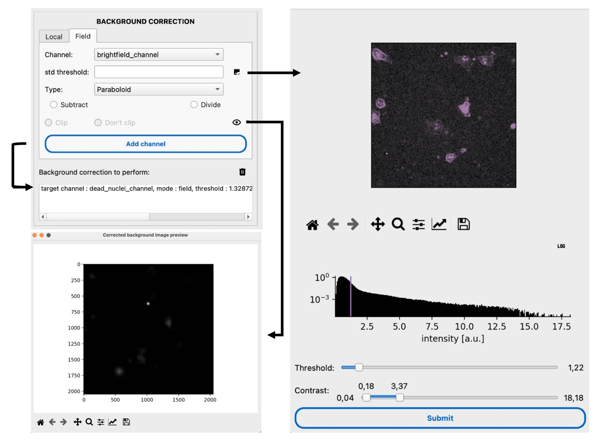
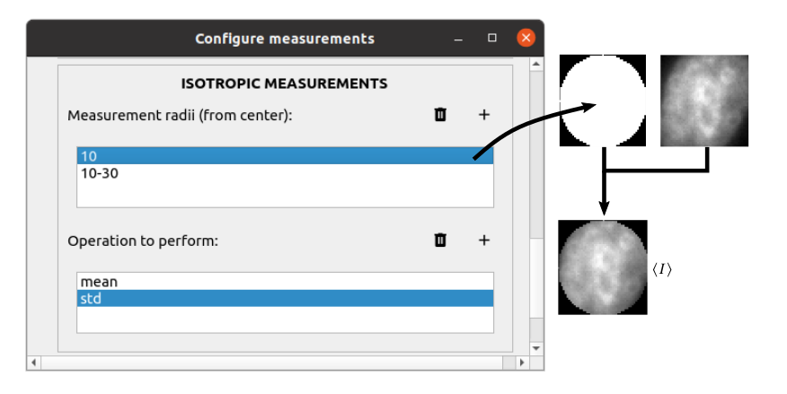
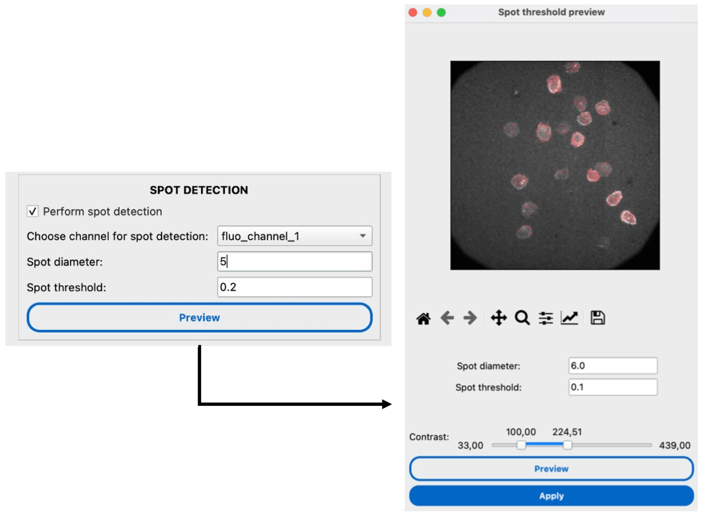
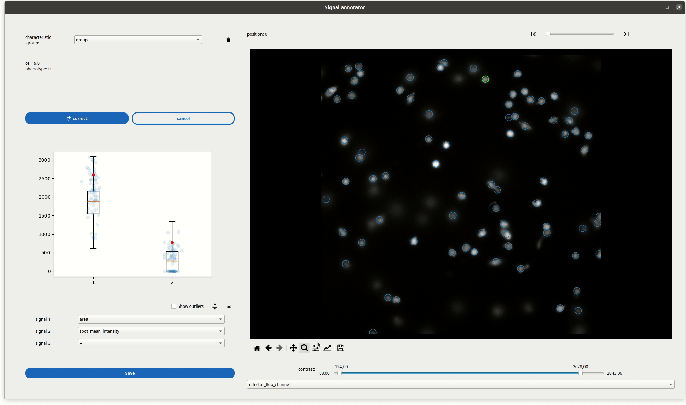

Measurements
============

.. _measure:

Prerequisite
------------

Cells must be segmented prior to measurements. The cells can be tracked or not.

I/O
---

The measurement module takes both the segmentation masks and microscopy images as input. If the cells were tracked prior to measurement, the trajectory table is appended with new columns corresponding to the measurements. Otherwise, a look-alike table is output by the module, without a ``TRACK_ID`` column (replaced with an ``ID`` column).

Overview
--------

Celldetective offers a range of single-cell measurement tools, from mask-based intensity features to texture analysis and cell-cell interactions. The measurements are performed frame by frame and appended to the tracking/detection table.

Background correction
~~~~~~~~~~~~~~~~~~~~~

Background correction removes uneven illumination before measuring intensities. Two strategies are available:

*   **Local** — each cell is corrected individually using the surrounding background intensity. The estimation distance is adjustable and the background can be either divided or subtracted.

*   **Field** — the entire field of view is fitted by a 2D surface (plane or paraboloid) after excluding cells by a threshold on the standard deviation. The extracted background is then divided or subtracted.

.. figure:: _static/local_correction.png
    :align: center
    :alt: local_correction

.. seealso::
    :doc:`how-to-guides/basics/measure-locally-corrected-intensity-measurements` for a step-by-step guide on local correction.

Mask-based measurements
~~~~~~~~~~~~~~~~~~~~~~~

The segmentation mask defines the ROI over which single-cell measurements are performed at each time point.

*   **Basic features** — morphological (``area``, ``perimeter``, ``eccentricity``, ``solidity``, etc.) and intensity properties (``intensity_mean``, ``intensity_max``, ``intensity_min``) from ``scikit-image.regionprops``. Only explicitly selected features are included in the output.

*   **Contour measurements** — intensity features within specific bands relative to the cell boundary. Positive distances measure inside (erosion); negative distances measure outside (dilation). A range ``(min, max)`` defines a ring band.

*   **:term:`Haralick Texture Features`** — texture analysis via gray-level co-occurrence matrices (:term:`GLCM`). Computationally expensive; optional.

.. seealso::
    :doc:`how-to-guides/basics/measure-peripheral-intensity` |
    :doc:`how-to-guides/basics/measure-texture` |
    :doc:`reference/measurements`

Position-based measurements
~~~~~~~~~~~~~~~~~~~~~~~~~~~~

Position-based measurements rely solely on centroid coordinates and are independent of mask shape. Useful for tracked cells where masks might be missing.

*   **Isotropic measurements** — intensities within circular or ring-shaped ROIs centered on the cell, with configurable radii and statistical operations (mean, std, sum, median, min, max).

Spot detection
~~~~~~~~~~~~~~

Detect and count intracellular spots (e.g., FISH probes, vesicles) using Laplacian of Gaussian (LoG) blob detection.

.. seealso::
    :doc:`how-to-guides/basics/detect-spots-within-cells` for a step-by-step guide.

Static classification
~~~~~~~~~~~~~~~~~~~~~

Cells can be classified into groups characterized by a distinct phenotype (e.g., *positive* vs *negative*) based on their measured features, using conditional rules in the **Classifier Widget**.

.. seealso::
    :doc:`how-to-guides/basics/perform-conditional-cell-classification` for a step-by-step guide.

Neighborhood measurements
~~~~~~~~~~~~~~~~~~~~~~~~~~

Neighborhood measurements quantify the spatial relationships between cells — essential for studying cell-cell interactions (e.g., immune cell targeting, tissue organization).

.. seealso::
    :doc:`how-to-guides/basics/measure-cell-interactions` for a step-by-step guide. |
    :ref:`Neighborhood Measurement Settings Reference <ref_neighborhood_settings>` for parameter details.

Phenotype Annotator
~~~~~~~~~~~~~~~~~~~

We provide an interactive viewer for inspecting single-cell measurements:

*   Clicking on cells highlights them and displays their specific measurements.
*   Timeseries trajectories are visualized for tracked cells.

*   Compare single-cell values against population distributions (strip plots, box plots).

