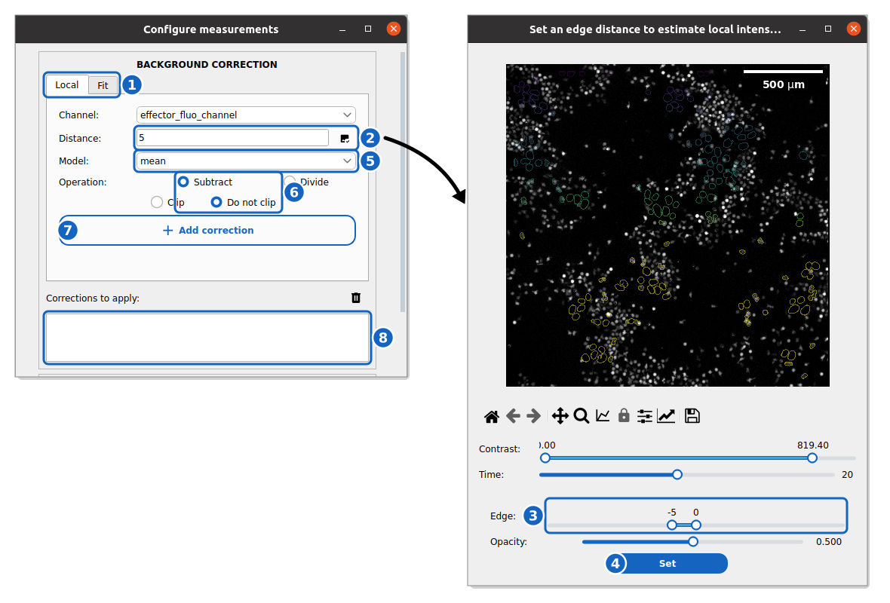
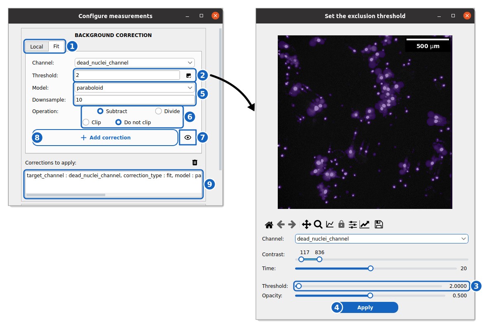
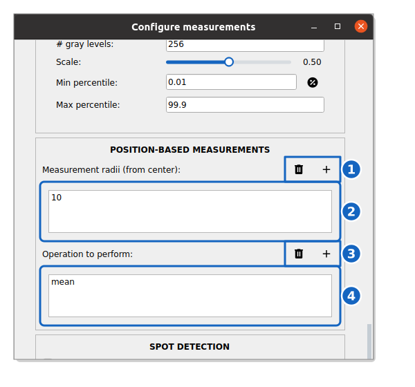
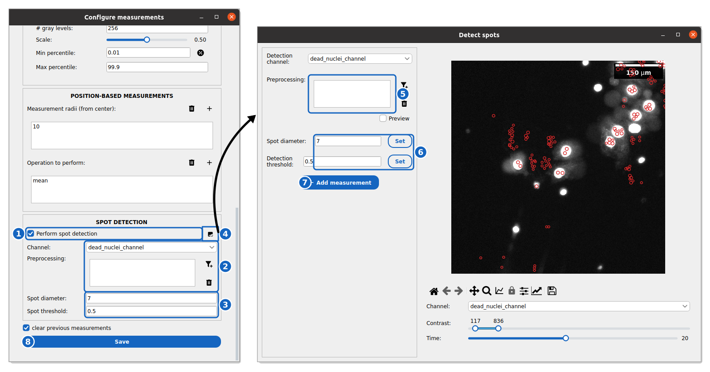
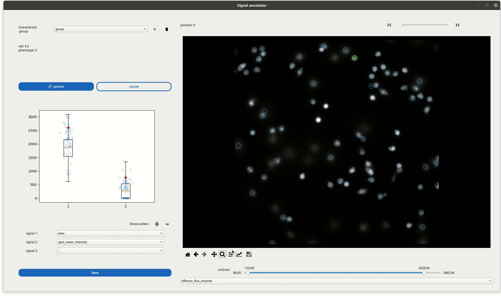

Measurements
============

.. _measure:

Prerequisite
------------

Cells must be segmented prior to measurements. The cells can be tracked or not.

I/O
---

The measurement module takes both the segmentation masks and microscopy images as input. If the cells were tracked prior to measurement, the trajectory table is appended with new columns corresponding to the measurements. Otherwise, a look-alike table is output by the module, without a ``TRACK_ID`` column (replaced with an ``ID`` column).

Overview
--------

Celldetective offers a range of single-cell measurement tools, from mask-based intensity features to texture analysis and cell-cell interactions. The measurements are performed frame by frame and appended to the tracking/detection table.

Background correction
~~~~~~~~~~~~~~~~~~~~~

Background correction removes uneven illumination before measuring intensities. It is set in the **BACKGROUND CORRECTION** block at the top of the measurement settings (:icon:`cog-outline,black` next to **MEASURE**), with two tabs:

*   **Local** — each cell is corrected individually using the intensity of a band around its mask. The band distance is adjustable, the background is estimated as its mean or median and either divided or subtracted.

*   **Fit** — the entire field of view is fitted by a 2D surface (paraboloid or plane) after excluding cells by a threshold on the standard-deviation-filtered image. The extracted background is then divided or subtracted.

    **Local background correction.** The Local tab of the measurement settings and the viewer that sets the distance of the background band around each cell.

In the **Local** tab (1), set the channel and the band distance (2), or press :icon:`image-check,black` to open a viewer where the **Edge** slider shows the band around each mask (3) and **Set** writes the distance back (4). Choose how the background is estimated, ``mean`` or ``median`` (5), and whether it is subtracted or divided, with or without clipping negative values (6). :icon:`plus,#1565c0` :blue:`Add correction` (7) appends the correction to the list of corrections to apply (8).

    **Fit background correction.** The Fit tab of the measurement settings and the viewer that sets the threshold excluding the cells from the fit.

In the **Fit** tab (1), the threshold (2) excludes the cells from the fit; the :icon:`image-check,black` button opens a viewer where the **Threshold** slider shows the excluded pixels in purple (3) and **Apply** writes the value back (4). Pick the 2D model and the downsampling factor used to fit it faster (5), the operation (6), preview the corrected image with :icon:`eye-outline,black` (7), then :icon:`plus,#1565c0` :blue:`Add correction` (8) to append it to the list (9).

.. seealso::
    :doc:`how-to-guides/basics/measure-locally-corrected-intensity-measurements` for a step-by-step guide on local correction.

Mask-based measurements
~~~~~~~~~~~~~~~~~~~~~~~

The segmentation mask defines the ROI over which single-cell measurements are performed at each time point.

*   **Basic features** — morphological (``area``, ``perimeter``, ``eccentricity``, ``solidity``, etc.) and intensity properties (``{channel}_mean``, ``{channel}_max``, ``{channel}_min``) from ``scikit-image.regionprops``. Only explicitly selected features are included in the output.

*   **Contour measurements** — intensity features within specific bands relative to the cell boundary. Positive distances measure inside (erosion); negative distances measure outside (dilation). A range ``(min, max)`` defines a ring band.

*   **Haralick Texture Features** — texture analysis via gray-level co-occurrence matrices (**GLCM**). Computationally expensive; optional.

.. seealso::
    :doc:`how-to-guides/basics/measure-peripheral-intensity` |
    :doc:`how-to-guides/basics/measure-texture` |
    :doc:`reference/measurements`

Position-based measurements
~~~~~~~~~~~~~~~~~~~~~~~~~~~~

Position-based measurements rely solely on centroid coordinates and are independent of mask shape. Useful for tracked cells where masks might be missing.

*   **Isotropic measurements** — intensities within circular or ring-shaped ROIs centered on the cell, with configurable radii and statistical operations (mean, std, sum, median, min, max).

    **Position-based measurements.** The radii and the operations of the isotropic measurements.

Add (:icon:`plus,black`) or remove (:icon:`delete,black`) radii (1) in the list of radii (2): a single value is a disk, ``10-30`` a ring between 10 and 30 pixels from the center. The operations (3) listed below (4) are computed on each of them, for every channel.

Spot detection
~~~~~~~~~~~~~~

Detect and count intracellular spots (e.g., FISH probes, vesicles) using Laplacian of Gaussian (LoG) blob detection.

.. seealso::
    :doc:`how-to-guides/basics/detect-spots-within-cells` for a step-by-step guide.

    **Spot detection.** The SPOT DETECTION block of the measurement settings and the viewer that tunes the detection on the dead nuclei channel of the ADCC demo.

Tick *Perform spot detection* (1), pick the channel and optional preprocessing filters (2), then the spot diameter and detection threshold (3). The :icon:`image-check,black` button (4) opens a viewer with the same filters (5); each **Set** runs the detection on the current frame and circles the spots in red (6). :icon:`plus,#1565c0` :blue:`Add measurement` (7) writes the values back to the settings, which are kept with :blue:`Save` (8).

Static classification
~~~~~~~~~~~~~~~~~~~~~

Cells can be classified into groups characterized by a distinct phenotype (e.g., *positive* vs *negative*) based on their measured features, using conditional rules in the **Classifier Widget**.

.. seealso::
    :doc:`how-to-guides/basics/perform-conditional-cell-classification` for a step-by-step guide.

Neighborhood measurements
~~~~~~~~~~~~~~~~~~~~~~~~~~

Neighborhood measurements quantify the spatial relationships between cells — essential for studying cell-cell interactions (e.g., immune cell targeting, tissue organization).

.. seealso::
    :doc:`how-to-guides/basics/measure-cell-interactions` for a step-by-step guide. |
    :ref:`Neighborhood Measurement Settings Reference <ref_neighborhood_settings>` for parameter details.

Phenotype Annotator
~~~~~~~~~~~~~~~~~~~

We provide an interactive viewer for inspecting single-cell measurements. The left panel is organized into two tabs:

**Signals tab**

*   Clicking on cells highlights them and displays their specific measurements.
*   Timeseries trajectories are visualized for tracked cells.
*   Compare single-cell values against population distributions (strip plots, box plots).
*   Toggle log scale, normalize features, or flag outliers directly from the toolbar.

**Cell Histogram tab**

*   Displays the pixel intensity histogram of the selected cell's segmentation mask on the current channel.
*   Vertical lines indicate the mean, median, and mode of the intensity distribution.
*   Toggle between count and density mode; in density mode, y-axis limits are remembered across frames for stable visualization.
*   Log scale toggle and save-image button are integrated into the matplotlib toolbar.

