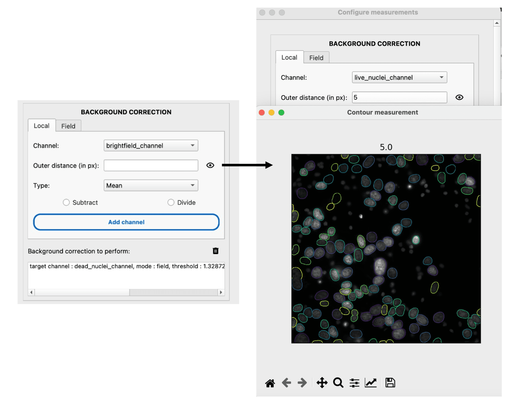

Measure
=======

.. _measure:

Prerequisite
------------

You must segment the cells prior to measurements. The cells can be tracked or not.

I/O
---

The measurement module takes both the segmentation masks and microscopy images as input. If the cells were tracked prior to measurement, the trajectory table is appended with new columns corresponding to the measurements. Otherwise, a look-alike table is output by the module, without a ``TRACK_ID`` column (replaced with an ``ID`` column).

Options
-------

Background correction
~~~~~~~~~~~~~~~~~~~~~

The background correction module allows you to correct the background intensity in a specific channel, 1) locally (``Local``) or 2) over the field of view (``Field``). 

In the ``Local`` mode, each cell is corrected one by one by the surrounding background intensity. You can estimate the background intensity level over any controlled distance. We provide a visualization tool for these background ROIs. 

You can measure 1) the mean or 2) the median intensity within the background ROI around each cell, which you can either 1) divide or 2) subtract from the intensity of the cell.

In most instances, the background can be fitted by a 2D function such as a plane or paraboloid, provided we can isolate the background from the cells on the image. You can set a threshold on the standard-deviation-transformed image to roughly exclude the cells from the fit. A visualizer accompanies you in the process. 

You can choose to 1) divide or 2) subtract the extracted background from the whole image. When subtracting, you can decide to clip negative values. Eventually, you can preview the corrected image and view the change in diagonal intensity profiles.

.. figure:: _static/field_correction.png
    :align: center
    :alt: field_correction

Mask-based measurements
~~~~~~~~~~~~~~~~~~~~~~~

The segmentation mask is an obvious starting point to perform single-cell measurements. The mask provides a ROI over which a series of measurements can be performed at each time point.

Basic Features
^^^^^^^^^^^^^^
The user can select specific features to measure from the list of available properties in ``scikit-image.regionprops``. Common features include:

*   **Morphological**: ``area``, ``perimeter``, ``eccentricity``, ``solidity``, ``orientation``, etc.
*   **Intensity**: ``intensity_mean``, ``intensity_max``, ``intensity_min``.

.. note::
    Only explicitly selected features are included in the final output table. Extra intensity properties (like percentiles) are not added unless specifically requested to keep the output table clean.

Contour Measurements
^^^^^^^^^^^^^^^^^^^^
You can measure intensity features within specific contour bands relative to the cell boundary.

*   **Distance**: Define a distance :math:`d` (in pixels) from the mask edge.

    *   Positive values (:math:`d > 0`) measure inside the cell (erosion).
    *   Negative values can be used to measure outside context (dilation).

*   **Range**: Define a range ``(min, max)`` to measure within a specific band (ring) derived from distance transforms.

Haralick Texture Features
^^^^^^^^^^^^^^^^^^^^^^^^^
For texture analysis, we provide Haralick feature computation based on gray-level co-occurrence matrices (GLCM). Due to computational cost, this is optional.

*   **Channel**: Select the specific channel to analyze (e.g., DNA/DAPI for chromatin texture).
*   **Distance**: The pixel distance offset for GLCM computation (default: 1).
*   **Gray Levels**: Number of quantized gray levels (bins) to reduce image complexity (default: 256 or lower for speed).
*   **Scale**: Downscaling factor (0-1) to speed up computation on large cells.
*   **Normalization**:

    *   **Percentile Mode**: Normalize intensities clips based on min/max percentiles (e.g., 0.01% - 99.9%).
    *   **Absolute Mode**: Normalize based on fixed min/max intensity values.

Position-based measurements
~~~~~~~~~~~~~~~~~~~~~~~~~~~

Position-based measurements are independent of the cell mask shape and rely solely on the centroid coordinates. This is useful for tracked cells where masks might be missing or interpolated.

Isotropic Measurements
^^^^^^^^^^^^^^^^^^^^^^
Measure intensities within circular or ring-shaped ROIs centered on the cell.

*   **Radii**: Define one or more radii (e.g., ``10`` px) or rings (e.g., ``10-15`` px).
*   **Operations**: Select statistical operations to apply within these ROIs: ``mean``, ``std``, ``sum``, ``median``, ``min``, ``max``.

.. figure:: _static/iso-measure.png
    :align: center
    :alt: iso_measurements

Spot detection
~~~~~~~~~~~~~~

Detect and count intracellular spots (e.g., FISH probes, vesicles) using a Laplacian of Gaussian (LoG) blob detection approach.

*   **Channel**: Select the target channel for detection.
*   **Diameter**: Approximate expected spot diameter in pixels.
*   **Threshold**: Relative intensity threshold to distinguish spots from background (0.0 - 1.0).

*   **Preprocessing**: Apply filters (e.g., smoothing, background subtraction) to enhance spots before detection.

Static Classification
~~~~~~~~~~~~~~~~~~~~~

Beyond simple measurements, you can classify cells into groups characterized by a distinct phenotype (e.g., *positive* vs *negative*, *large* vs *small*) based on their measured features.

This is done via the **Classifier Widget**, which allows you to define conditional rules (e.g., ``area > 500 and intensity_mean > 200``) to create new "Status" or "Group" columns in your data.

.. seealso::
    :doc:`/how-to-guides/basics/perform-conditional-cell-classification` for a step-by-step guide on creating these classifications.

Once a classification is applied (with **Time correlated** unchecked), it creates a static attribute that can be explored in the **Static Measurements Annotator**.

Static measurements annotation
~~~~~~~~~~~~~~~~~~~~~~~~~~~~~~

We provide a viewer for the measurements of single cells to visualize and validate your data.

*   **Interactive Visualization**: Click on cells to highlight them and see their specific measurements.
*   **Timeseries Plots**: View trajectories of measurements over time for tracked cells.
*   **Population Analysis**: Compare single-cell values against the population distribution (strip plots, box plots).

