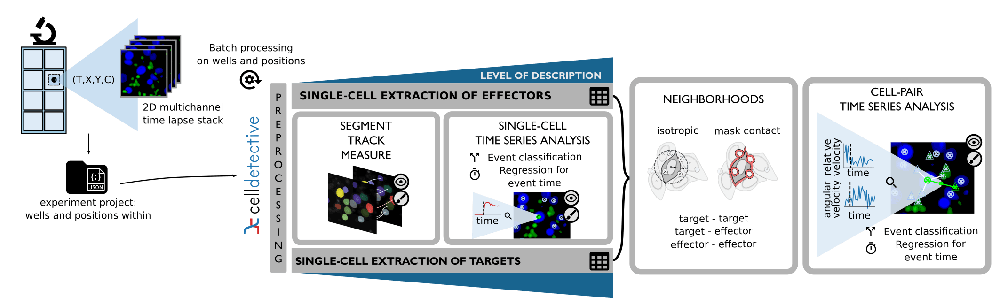

Overview
========

.. _overview:

Description
-----------

   

While single-cell analysis tools have become increasingly accessible, few are tailored for complex time-lapse experiments targeting interacting cell populations and multimodal imaging. Analyzing how these populations evolve over time often requires extracting high-level response functions—such as population survival or the dynamics of single-cell events—a process that typically necessitates advanced programming skills.

**Celldetective** provides a unified, no-code solution for these challenges. It is an open-source Python platform designed for biologists to study interacting cell populations in multimodal time-lapse microscopy. The software is specifically optimized for high-throughput, high-temporal-resolution imaging of quasi-2D systems. By prioritizing temporal sampling over Z-axis depth, Celldetective enables the capture of rapid biological dynamics that are often the focal point of interaction studies, where Z-stacking would otherwise limit throughput or resolution.

By integrating state-of-the-art segmentation and tracking algorithms into a comprehensive GUI, Celldetective enables an end-to-end workflow: from data preprocessing to the detection of single-cell events and the automated extraction of population-level response functions. Its key features include:

* **Comprehensive single-cell image analysis** : Celldetective ships :doc:`segmentation <segment>`, :doc:`tracking <track>`, :doc:`measurement <measure>`, :doc:`neighborhood <interactions>`, and :doc:`event detection <signals-and-events>` modules, as well as :doc:`survival analysis <analysis>` and :doc:`timeseries synchronization <how-to-guides/basics/plot-synchronized-time-series>` from single-cell signals, for multiple populations of interest. Image preprocessing tools, including model-free and model-based background correction, are also provided to prepare data before analysis.

* **Integration of state-of-the-art solutions** : Celldetective harnesses state-of-the-art segmentation techniques (:term:`StarDist` [#]_, :term:`Cellpose` [#]_ , [#]_) as well as threshold-based segmentation, and tracking algorithms (:term:`bTrack` [#]_, :term:`trackpy`), along with the napari viewer [#]_ with custom plugins to correct masks and tracks. These algorithms are interfaced to be well integrated and accessible for the target audience, in the context of complex biological applications.

* **Rich measurement capabilities** : beyond standard morphological and intensity features, Celldetective supports :doc:`Haralick texture analysis <how-to-guides/basics/measure-texture>`, :doc:`spot detection <how-to-guides/basics/detect-spots-within-cells>` within cells, radial intensity profiles, local intensity normalization, and user-defined custom measurements through an extensible :ref:`extra-properties system <extra_properties>`.

* **A framework for event description and annotations** : we propose a broad and intuitive framework to annotate and automate the :doc:`detection of events <signals-and-events>` from single-cell signals through deep-learning signal classification and regression, assisted by an :doc:`interactive timeseries viewer <how-to-guides/basics/annotate-an-event>`. The event formulation is directly exploited to define the population's :doc:`survival responses <analysis>`.

* **A neighborhood scheme to study cell-cell interactions** : we introduce a :doc:`neighborhood scheme <interactions>` to relate the spatio-temporal distribution and measurements of multiple cell populations, including relative and pair-level measurements. This allows the study of how cell-cell interactions affect single-cell and population responses.

* **Deep Learning customization in GUI** : Celldetective simplifies the :doc:`specialization of Deep Learning models <how-to-guides/advanced/train-a-segmentation-model-from-scratch>` or the creation of new ones adapted to user data, by facilitating the creation of training sets and the training of such models, without having to write a single line of code.

* **In-software analysis** : Celldetective ships a :doc:`Table Explorer <table_exploration>` with built-in data operations (arithmetic, differentiation, log, calibration, query filtering, column merging) and visualization tools to plot time series, build survival curves, compare measurement distributions across biological conditions using box plots, strip plots, or boxen plots. Statistical tests (Cliff's Delta effect size [#]_, Kolmogorov–Smirnov test [#]_ [#]_) are also available directly in the GUI.

* **A library of segmentation and signal models**: we created specific models to investigate a co-culture of MCF-7 cells and primary NK cells, that are available directly in the software with a large collection of generalist models developed by the :term:`StarDist` and :term:`Cellpose` teams, which are a perfect starting point to segment single cells in a new biological system. 

* **Accessible and open source** : Celldetective does not require any coding skills. The software, its models and datasets are made fully open source to encourage transparency and reproducibility.

System requirements
-------------------

Celldetective is designed to run on standard workstations. It supports GPU acceleration (NVIDIA) for Deep Learning tasks but can run fully on CPU with multithreading.

For detailed hardware and software specifications, see the :ref:`System Requirements Reference <reference/system-requirements>`. 

Bibliography
------------

.. [#] Schmidt, U., Weigert, M., Broaddus, C. & Myers, G. Cell Detection with Star-Convex Polygons. in Medical Image Computing and Computer Assisted Intervention – MICCAI 2018 (eds. Frangi, A. F., Schnabel, J. A., Davatzikos, C., Alberola-López, C. & Fichtinger, G.) 265–273 (Springer International Publishing, Cham, 2018). doi:10.1007/978-3-030-00934-2_30.

.. [#] Stringer, C., Wang, T., Michaelos, M. & Pachitariu, M. Cellpose: a generalist algorithm for cellular segmentation. Nat Methods 18, 100–106 (2021).

.. [#] Pachitariu, M. & Stringer, C. Cellpose 2.0: how to train your own model. Nat Methods 19, 1634–1641 (2022).

.. [#] Ulicna, K., Vallardi, G., Charras, G. & Lowe, A. R. Automated Deep Lineage Tree Analysis Using a Bayesian Single Cell Tracking Approach. Frontiers in Computer Science 3, (2021).

.. [#] Ahlers, J. et al. napari: a multi-dimensional image viewer for Python. Zenodo https://doi.org/10.5281/zenodo.8115575 (2023).

.. [#] Cliff, N. Dominance statistics: Ordinal analyses to answer ordinal questions. Psychological Bulletin 114, 494–509 (1993).

.. [#] Kolmogorov, A. N. Sulla determinazione empirica di una legge di distribuzione. Giornale dell’Istituto Italiano degli Attuari 4, 83–91 (1933).

.. [#] Smirnov, N. Table for estimating the goodness of fit of empirical distributions. Annals of Mathematical Statistics 19, 279–281 (1948).

