Segmentation
============

.. _segment:

I/O
---

The **segmentation module** takes a stack of microscopy images as input and produces a stack of **instance segmentation masks**, delineating each cell in the images. The results are saved frame by frame in a ``labels_*population*`` subfolder within each position folder.

Overview
--------

The process of instance segmentation takes an image (multichannel or not) as its input and yields a label image (2D), where each segmented object is attributed a single label. 

In Celldetective, you may want to specifically segment up to two cell populations of interest on the images (typically target and effector cells but it could be anything). Segmentation can be carried out using traditional segmentation pipelines (based on filters and thresholds) or using Deep-learning models trained for such task. Celldetective proposes both options and allows a cross-talk between the two. As illustrated below, the output of a traditional segmentation can be corrected and used as an input to a DL model directly in Celldetective. That is only one of many paths to perform segmentation in Celldetective.

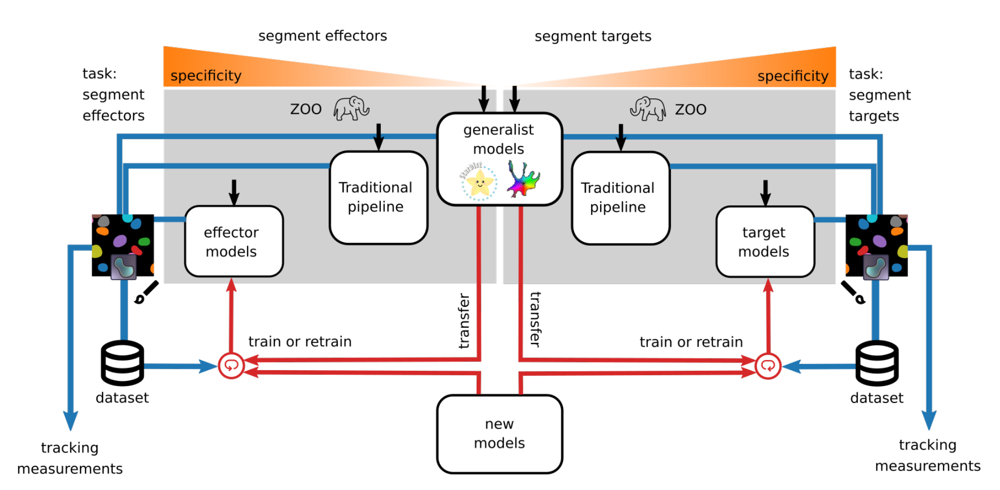
    
    **Overview of segmentation options in Celldetective.** Celldetective provides several entry points (black arrows) to perform segmentation, with the intent of segmenting specifically a cell population (left : effectors, right : targets). The masks output from each segmentation technique can be visualized and manually corrected in napari. Exporting these corrections into a paired image and masks dataset can be used either to fit a generalist model (transfer learning) or train one from scratch. Once the segmentation is satisfactory enough, the user can decide to proceed with the tracking and measurement modules.

Traditional segmentation
------------------------

In many applications, cell or nucleus segmentation can be achieved through the use of filters and thresholds, without having to resort to a Deep Learning model. Adapting such a model to a new system can be time-consuming and computationally expensive, as it usually requires numerous annotations. To ensure a user-friendly experience with Celldetective, we developed a robust framework for traditional segmentation as a potent alternative to calling a Deep Learning model.

We call this UI the ``Threshold Configuration Wizard`` (TCW). This interface allows you to interactively build a segmentation pipeline step-by-step.

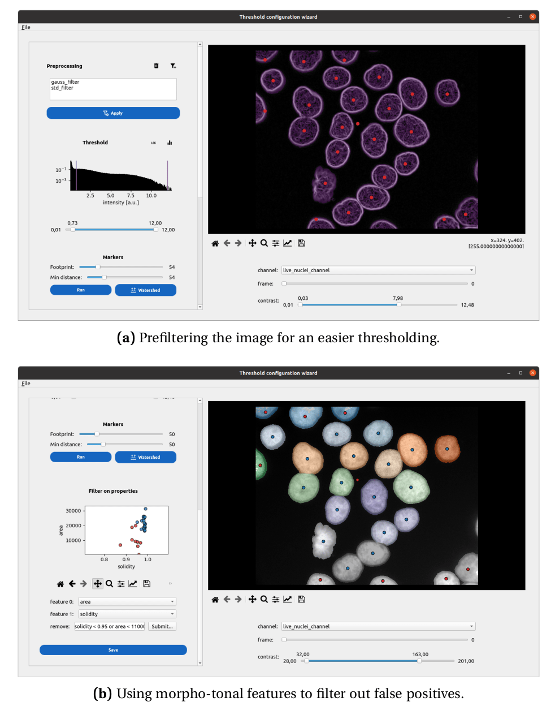

*The Threshold Configuration Wizard interface showing preprocessing, thresholding, and object detection controls.*

The wizard guides you through four stages:

1. **Preprocessing** — enhance the image with filters (``gauss``, ``median``, ``std``, etc.) to make objects easier to detect.
2. **Thresholding** — binarize the image to separate foreground from background.
3. **Object Detection** — split touching objects using a watershed or label all connected components.
4. **Property Filtering** — remove false positives based on morphology or intensity queries (e.g., ``area > 100``).

The pipeline can be saved as a ``.json`` config file, which can be loaded later via the **Upload Model** window.

For a complete step-by-step walkthrough, see :doc:`How to segment with the Threshold Configuration Wizard <how-to-guides/basics/segment-with-threshold-wizard>`.

Deep learning segmentation
--------------------------

Models
~~~~~~

Celldetective ships with Deep-learning segmentation models trained with the **StarDist** [#stardist]_ or **Cellpose** [#cellpose]_ [#cellpose2]_ algorithm. They are split in two families: 

#. **Generalist models** — models published in the literature that have been trained on thousands of images with one or two channels, on general tasks such as segmenting all nuclei visible on the images. In some cases, more than one modality was passed in the channel slots during training to force the model to generalize and be less sensitive to the modality. 
#. **Population-specific models** — models that we trained from scratch on brand new multimodal data to achieve more specific tasks such as detecting the nuclei of a population in the presence of another. In this configuration, accurate segmentation often requires to look at multiple channels at once, *i.e.* performing a multimodal interpretation.

**Generalist models.** This table lists the different generalist models (**Cellpose** or **StarDist**) which can be called natively in Celldetective. The images have been sampled from their respective datasets, cropped to ( 200 × 200 ) px and rescaled homogeneously to fit in the table.

.. list-table::
   :widths: 20 20 15 30 15
   :header-rows: 1

   * - Name
     - Modalities
     - # channels
     - Dataset
     - Sample Image
   * - ``CP_cyto3``
     - cytoplasm, nucleus
     - 2
     - Cellpose [#cellpose]_ & user-submitted images
     - |cellpose-sample|
   * - ``CP_livecell``
     - cytoplasm (BF), black
     - 2
     - LiveCell [#livecell]_
     - |livecell-sample|
   * - ``CP_tissuenet``
     - cytoplasm, nucleus
     - 2
     - TissueNet [#tissuenet]_
     - /
   * - ``CP_nuclei``
     - nucleus, black
     - 2
     - ?
     - /
   * - ``SD_versatile_fluo``
     - nucleus
     - 1
     - subset of DSB 2018 [#dsb2018]_
     - |dsb2018|
   * - ``SD_versatile_he``
     - H&E RGB
     - 1
     - MonoNuSeg 2018 [#mononuseg]_, TNBC 2018 [#tnbc]_
     - |mononuseg|

**Target models.** MCF-7 nuclei segmentation models that we developed for our application. The models have been trained on the ``db_mcf7_nuclei_w_primary_NK`` dataset available in Zenodo.

.. list-table::
   :widths: 25 25 15 15 10 10
   :header-rows: 1

   * - Name
     - Channels
     - Type
     - Pretrained
     - Spatial calib. (μm)
     - Sample Image
   * - ``mcf7_nuc_multimodal``
     - Hoechst, Brightfield, CFSE, PI
     - StarDist
     - None
     - 0.3112
     - |4chan|
   * - ``mcf7_nuc_stardist_transfer``
     - Hoechst
     - StarDist
     - ``SD_versatile_fluo``
     - 0.3112
     - |nuchcan|

**Effector models.** Primary NK segmentation models that we developed for our application. The models have been trained on the ``db_primary_NK_w_mcf7`` dataset available in Zenodo.

.. list-table::
   :widths: 25 25 15 15 10 10
   :header-rows: 1

   * - Name
     - Channels
     - Type
     - Pretrained
     - Spatial calib. (μm)
     - Sample Image
   * - ``primNK_multimodal``
     - brightfield, CFSE, Hoechst
     - Cellpose
     - None
     - 0.2178
     - |bf-cfse-h|
   * - ``primNK_cfse``
     - CFSE, None
     - Cellpose
     - ``CP_cyto2``
     - 0.2178
     - |cfse|
   * - ``lymphocytes_ricm``
     - RICM
     - Cellpose
     - None
     - 0.2
     - |ricm|

Importing and applying models
~~~~~~~~~~~~~~~~~~~~~~~~~~~~~

Models are imported via the :icon:`upload,black` button in the Segmentation panel. This creates a configuration file that maps your experiment's channels to the model's expected inputs, including spatial calibration and normalization.

For a detailed list of all import parameters, see the :ref:`Segmentation Data Import Reference <ref_segmentation_settings>`.

For a complete step-by-step walkthrough (including generalist model configuration), see :doc:`How to apply a segmentation model <how-to-guides/basics/apply-a-segmentation-model>`.

Mask visualization and correction
---------------------------------

Once a position is segmented, the results can be visualized in **napari** by clicking the :icon:`eye,black` button in the segmentation section. This overlays the segmented masks on the original images.

With napari, segmentation mistakes can be corrected using the brush, eraser, and fill tools. Celldetective provides two plugins:

#. **Save the modified labels** — overwrite the masks in place.
#. **Export a training sample** — create an annotated pair (image + mask) to train a Deep Learning model on your data.

Above these buttons, a set of options controls the automatic fixes applied to the masks when they are saved or exported:

*   **Split merged labels** — separate objects that mistakenly share a single label value (detected when an object's bounding box is much larger than the object itself). Enabled by default.
*   **Remove small objects** — discard objects smaller than the **Min object area (px²)** threshold (default ``9``, i.e. 3×3 pixels). Enabled by default. Uncheck it (or set the area to ``0``) to keep every object regardless of size.
*   **Fill holes in masks** — fill holes inside cell masks. Disabled by default.

The labels are always re-numbered consecutively from ``1`` on save to avoid encoding errors, regardless of these options.

For a step-by-step annotation workflow, see :doc:`How to annotate for segmentation <how-to-guides/basics/annotate-for-segmentation>`.
To train a model on your annotations, see :doc:`How to train a segmentation model <how-to-guides/advanced/train-a-segmentation-model-from-scratch>`.

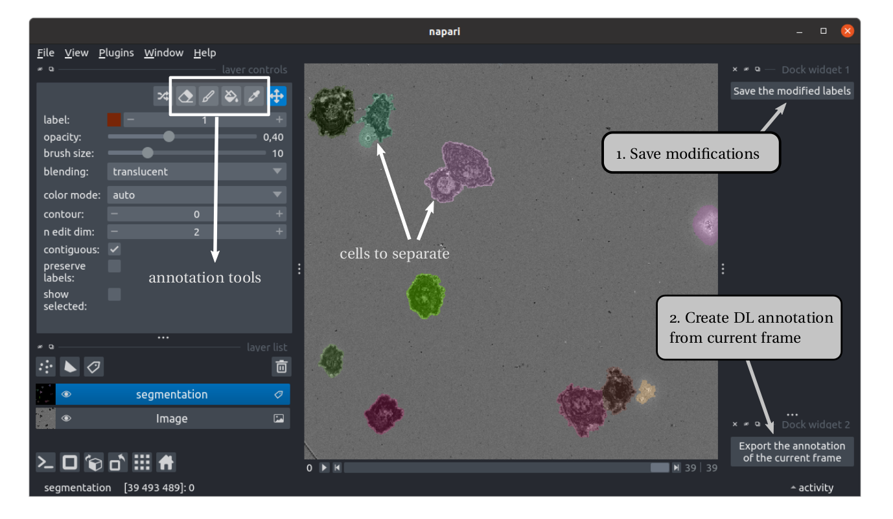
    
    **napari**. napari provides the basic requirements of image manipulation software, namely a brush, rubber, bucket and pipette, to work on the segmentation layer. In this RICM image of spreading NK cells, two couples of cells have been mistakenly segmented as one object and must be separated. On the right panel, two plugins specific to Celldetective allow 1) the export of the modified masks directly in the position folder, and 2) to create automatically an annotation consisting of the current multichannel frame, the modified mask and a configuration file specifying the modality content of the image and its spatial calibration.

Segmenting a single frame from napari
~~~~~~~~~~~~~~~~~~~~~~~~~~~~~~~~~~~~~

The top of the same right-hand panel can run a segmentation model on the frame
currently on screen, without leaving the viewer or launching a run over the whole
position. It is the quickest way to try a model, a channel mapping or a threshold
on one frame and look at the result straight away.

*   **model** — any model available for this population, plus the generic ones.
    A model that has not been downloaded yet is offered too; it is fetched on the
    first run.
*   **channels** — one dropdown per input slot of the chosen model, seeded from
    the mapping already saved by the import dialog. Set a slot to ``None`` to
    leave it blank. The same experiment channel may feed several slots.
*   **parameters** — the values that model type actually takes: **diameter**,
    **cell probability** and **flow threshold** for Cellpose models, and **cell
    size** wherever the model declares the size it was trained on. Leave a field
    blank to use the model's own value.
*   **Replace the labels on this frame** — ticked, the frame is segmented afresh.
    Unticked, the existing labels are kept and the new ones only fill the
    background, so manual corrections on that frame survive.

The run happens on a background thread, so the viewer stays usable; the button
turns into **Cancel** while it works. Inference itself cannot be interrupted, so
cancelling during a forward pass returns the interface to normal and discards the
result when it lands, while cancelling during model loading stops before any
inference happens.

The result is written into the ``segmentation`` layer and can be undone with
:kbd:`Ctrl+Z` like any other edit. Nothing reaches disk until **Save the modified
labels** is used, and the settings chosen here stay local to the napari session:
they are never written back into the model configuration, so trying something out
cannot change what the next full-position run does.

.. note::

    Segmentation here runs on the CPU, leaving the GPU to the viewer's renderer.
    A single frame is quick, but expect it to be slower than the same model
    running over a position in the main window.

References
----------

.. [#kromp] Florian KROMP, Eva BOZSAKY, Fikret RIFATBEGOVIC, Lukas FISCHER, Magdalena AMBROS, Maria BERNEDER, Tamara WEISS, Daria LAZIC, Wolfgang DÖRR, Allan HANBURY, Klaus BEISKE et al. « An Annotated Fluorescence Image Dataset for Training Nuclear Segmentation Methods ». In : Scientific Data 7.1 (1 11 août 2020), p. 262. ISSN : 2052-4463. DOI : 10.1038/s41597-020-00608-w . URL : https://www.nature.com/articles/s41597-020-00608-w.

.. [#napari] Ahlers, J. et al. napari: a multi-dimensional image viewer for Python. Zenodo https://doi.org/10.5281/zenodo.8115575 (2023).

.. [#stardist] Schmidt, U., Weigert, M., Broaddus, C. & Myers, G. Cell Detection with Star-Convex Polygons. in Medical Image Computing and Computer Assisted Intervention – MICCAI 2018 (eds. Frangi, A. F., Schnabel, J. A., Davatzikos, C., Alberola-López, C. & Fichtinger, G.) 265–273 (Springer International Publishing, Cham, 2018). doi:10.1007/978-3-030-00934-2_30.

.. [#cellpose] Stringer, C., Wang, T., Michaelos, M. & Pachitariu, M. Cellpose: a generalist algorithm for cellular segmentation. Nat Methods 18, 100–106 (2021).

.. [#cellpose2] Pachitariu, M. & Stringer, C. Cellpose 2.0: how to train your own model. Nat Methods 19, 1634–1641 (2022).

.. [#livecell] Edlund, C. et al. LIVECell—A Large-Scale Dataset for Label-Free Live Cell Segmentation. Nat Methods 18, 1038–1045 (2021). doi:10.1038/s41592-021-01249-6.

.. [#tissuenet] Barshir, R. et al. The TissueNet Database of Human Tissue Protein--Protein Interactions. Nucleic Acids Research 41, D841-D844 (2013). doi:10.1093/nar/gks1198.

.. [#dsb2018] Caicedo, J. C. et al. Nucleus Segmentation across Imaging Experiments: The 2018 Data Science Bowl. Nat Methods 16, 1247–1253 (2019). doi:10.1038/s41592-019-0612-7.

.. [#mononuseg] Kumar, N. et al. A Multi-Organ Nucleus Segmentation Challenge. IEEE Trans Med Imaging 39, 1380–1391 (2020). doi:10.1109/TMI.2019.2947628.

.. [#tnbc] Naylor, P., Lae, M., Reyal, F. & Walter, T. Segmentation of Nuclei in Histopathology Images by Deep Regression of the Distance Map. IEEE Trans Med Imaging 38, 448–459 (2019). doi:10.1109/TMI.2018.2865709.

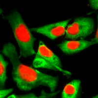

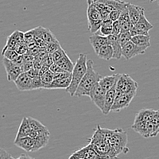

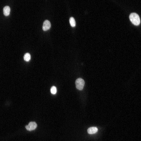

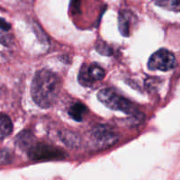

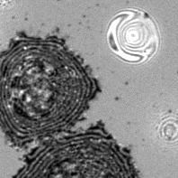

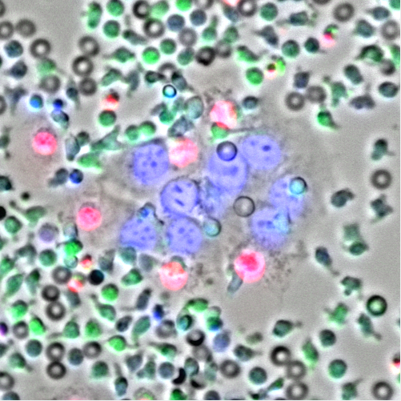

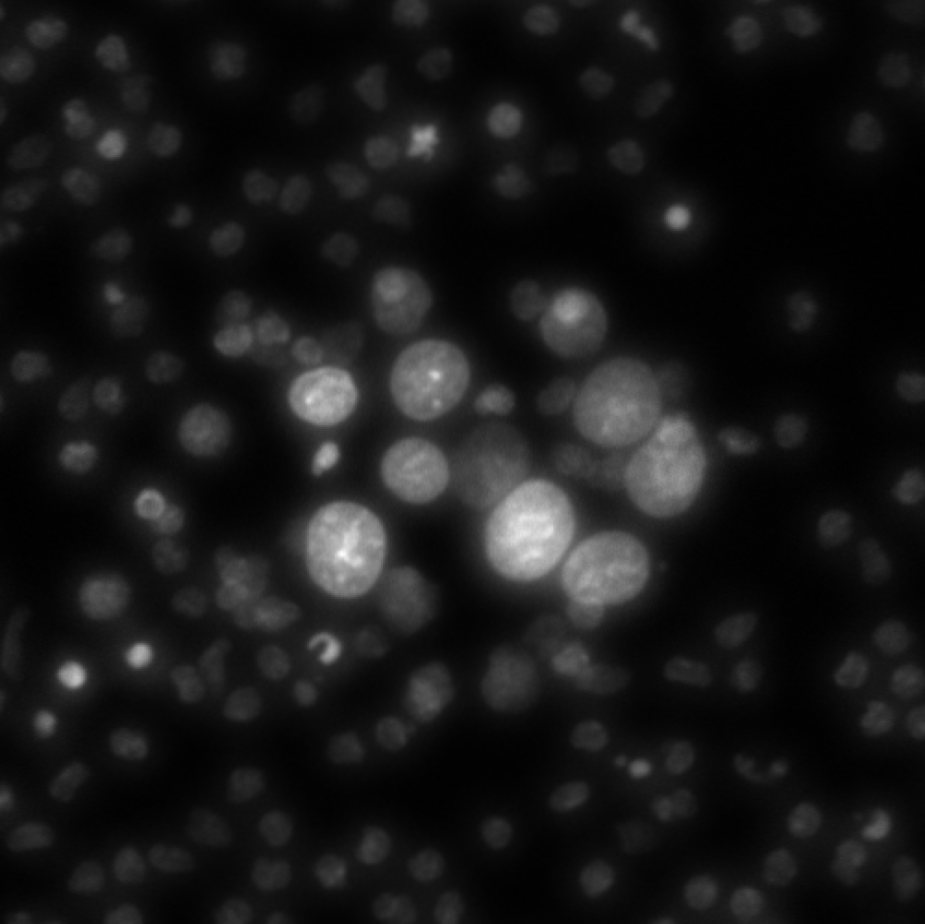

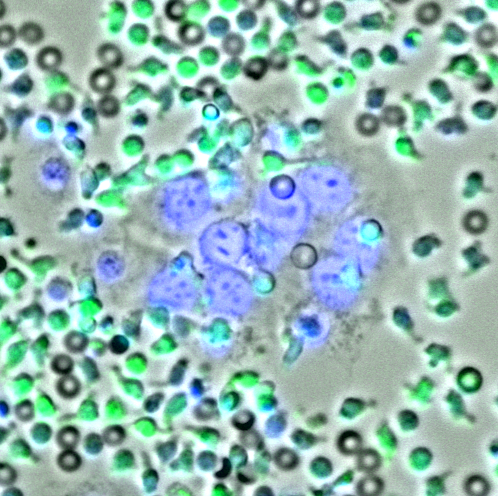

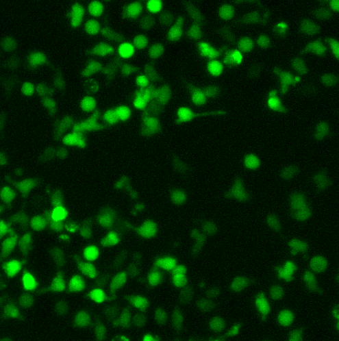
