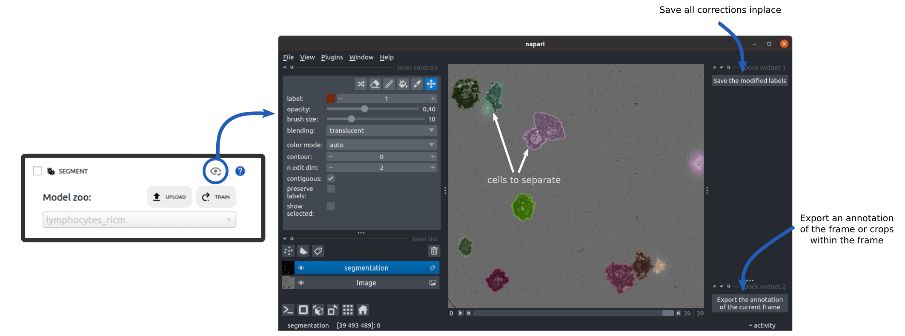

Segment
=======

.. _segment:

I/O
---

The **segmentation module** takes a stack of microscopy images as input and produces a stack of **instance segmentation masks**, delineating each cell in the images. The results are saved frame by frame in a ``labels_*population*`` subfolder within each position folder.

Overview
--------

The process of instance segmentation takes an image (multichannel or not) as its input and yields a label image (2D), where each segmented object is attributed a single label. 

In Celldetective, you may want to specifically segment up to two cell populations of interest on the images (typically target and effector cells but it could be anything). Segmentation can be carried out using traditional segmentation pipelines (based on filters and thresholds) or using Deep-learning models trained for such task. Celldetective proposes both options and allows a cross-talk between the two. As illustrated below, the output of a traditional segmentation can be corrected and used as an input to a DL model directly in Celldetective. That is only one of many paths to perform segmentation in Celldetective.

.. figure:: _static/segmentation-options.png
    :align: center
    :alt: seg_options
    
    **Overview of segmentation options in Celldetective.** Celldetective provides several entry points (black arrows) to perform segmentation, with the intent of segmenting specifically a cell population (left : effectors, right : targets). The masks output from each segmentation technique can be visualized and manually corrected in napari. Exporting these corrections into a paired image and masks dataset can be used either to fit a generalist model (transfer learning) or train one from scratch. Once the segmentation is satisfactory enough, the user can decide to proceed with the tracking and measurement modules.

Traditional segmentation
------------------------

In many applications, cell or nucleus segmentation can be achieved through the use of filters and thresholds, without having to resort to a Deep Learning model. Adapting such a model to a new system can be time-consuming and computationally expensive, as it usually requires numerous annotations. To ensure a user-friendly experience with Celldetective, we developed a robust framework for traditional segmentation as a potent alternative to calling a Deep Learning model.

We call this UI the ``Threshold Configuration Wizard`` (TCW). This interface allows you to interactively build a segmentation pipeline step-by-step.

Opening the Threshold Configuration Wizard
~~~~~~~~~~~~~~~~~~~~~~~~~~~~~~~~~~~~~~~~~~

1.  Select a specific position within your experiment.
2.  In the "Segmentation" section of the Control Panel, locate the population of interest (e.g., Targets or Effectors).
3.  Click the ``UPLOAD`` button.
4.  Toggle the **Threshold** option.
5.  Click the **Threshold Config Wizard** button to open the interface.

*The Threshold Configuration Wizard interface showing preprocessing, thresholding, and object detection controls.*

Configuring the Pipeline
~~~~~~~~~~~~~~~~~~~~~~~~

The wizard guides you through four main steps. Changes are applied immediately to the current frame.

1. Preprocessing
^^^^^^^^^^^^^^^^
Enhance your image to make objects easier to detect.
*   **Add Filter:** Select a filter (e.g., ``gauss``, ``median``, ``std``) and kernel size, then click **Add**.
*   **Remove Filter:** Double-click a filter in the list to remove it.
*   **Apply:** Click **Apply** to see the effect on the image.

2. Thresholding
^^^^^^^^^^^^^^^
Binarize the image to separate foreground (cells) from background.
*   **Slider:** Adjust the min/max sliders to define the intensity range of fit.
*   **Histogram:** Use the histogram to identify intensity peaks. Toggle **Log scale** for better visibility of low-intensity pixels.
*   **Fill Holes:** Keep this checked to automatically fill holes inside detected objects.

3. Object Detection (Split / Merge)
^^^^^^^^^^^^^^^^^^^^^^^^^^^^^^^^^^^
Convert the binary mask into individual objects.

**Option A: Markers (Watershed)**
Best for touching cells or nuclei.
*   **Footprint:** Adjust the size of the local region used to find distinct peaks. Larger values merge peaks; smaller values split them.
*   **Min Distance:** Set the minimum allowed distance between two object centers.
*   **Run:** Click **Run** to detect markers (shown as red dots).
*   **Watershed:** Click **Watershed** to expand markers into object boundaries.

**Option B: All Objects**
Best for well-separated objects.
*   **Select:** Choose **all non-contiguous objects**.
*   **Watershed:** Click **Watershed** to label all connected components directly.

4. Property Filtering
^^^^^^^^^^^^^^^^^^^^^
Remove false positives based on morphology or intensity.
*   **Visualize:** Use the dropdowns to plot two properties (e.g., ``area`` vs ``solidity``) on the scatter plot.
*   **Select:** Click points on the scatter plot to highlight the corresponding object in the viewer.
*   **Query:** Enter a filtering query in the text box (e.g., ``area > 100`` or ``solidity > 0.9``).
*   **Filter:** Click **Submit Query** to remove objects that don't match the criteria.

Saving and Applying
~~~~~~~~~~~~~~~~~~~

Once satisfied with the segmentation on the current frame:

1.  Click **Save**. The configuration is saved as a ``.json`` file in your experiment's ``configs/`` folder.
2.  The wizard closes, and the config file path is automatically loaded into the **Upload Model** window.
3.  Click **Upload** to confirm.
4.  To process the entire specific position or experiment, select **Threshold** in the segmentation zoo and click **Submit**.

.. note::
    
    You must reload the threshold config file if you reopen the experiment later.

Deep learning segmentation
--------------------------

Models
~~~~~~

Simultaneously, we propose Deep-learning segmentation models trained with the StarDist [#]_ or Cellpose [#]_ [#]_ algorithm. They are split in two families: 

#. The generalist models: models published in the literature that have been trained on thousands of images with one or two channels, on general tasks such as segmenting all nuclei visible on the images. In some cases, more than one modality was passed in the channel slots during training to force the model to generalize and be less sensitive to the modality. 
#. Models specific to a cell population: models that we trained from scratch on brand new multimodal data to achieve more specific tasks such as detecting the nuclei of a population in the presence of another. In this configuration, accurate segmentation often requires to look at multiple channels at once, *i.e.* performing a multimodal interpretation.

.. figure:: _static/table-generalist-models.png
    :align: center
    :alt: table_generalist
    
    **Generalist models.** This table lists the different generalist models (Cellpose or StarDist) which can be called natively in Celldetective. The images have been sampled from their respective datasets, cropped to ( 200 × 200 ) px and rescaled homogeneously to fit in the table.

    
    **Target models.** MCF-7 nuclei segmentation models that we developed for our application. The models have been trained on the ``db_mcf7_nuclei_w_primary_NK`` dataset available in Zenodo.

.. figure:: _static/effector-models.png
    :align: center
    :alt: table_effector_models
    
    **Effector models.** Primary NK segmentation models that we developed for our application. The models have been trained on the ``db_primary_NK_w_mcf7`` dataset available in Zenodo.

Importing and Configuring Models
~~~~~~~~~~~~~~~~~~~~~~~~~~~~~~~~

If you have trained a model (using Celldetective or externally) or want to reuse a saved Threshold configuration, you must import it. This process creates a configuration file ensuring the model receives data correctly (correct resolution, normalization, and channel mapping).

1. In the **Segmentation** section of the Control Panel, click ``UPLOAD``.
2. Select the model type (**StarDist**, **Cellpose**, or **Threshold**).
3. Click **Choose File** to select your model folder (StarDist) or file (Cellpose/JSON).

Configuration Fields
^^^^^^^^^^^^^^^^^^^^

The import window creates a configuration file ensuring the model receives data correctly.

For a detailed list of all configuration parameters (Spatial Calibration, Channel Mapping, Normalization, etc.), see the :ref:`Segmentation Data Import Reference <ref_segmentation_settings>`.

**Finishing Up**

Click **Upload** to save the model and its configuration to the project's model zoo.

Apply a model to your data
~~~~~~~~~~~~~~~~~~~~~~~~~~

The imported models are now available in the segmentation model zoo.
1. Tick the ``SEGMENT`` option in the control panel.
2. Select your model from the dropdown list.
3. Click **Submit** to start processing.

If employing a generalist model (e.g., ``SD_versatile_fluo``), a **Channel Selection** window will appear after you click **Submit**.
You must explicitly map your experiment's channels to the model's expected inputs to ensure the correct data is processed:

*   **SD_versatile_fluo**: Select the channel containing the nuclei (e.g., DAPI or Hoechst).
*   **SD_versatile_he**: Select the corresponding RGB channels (if dealing with H&E staining).

Image rescaling and normalization are handled automatically based on the internal model configuration.

Similarly, for generalist Cellpose models (e.g., ``CP_cyto2``, ``CP_nuclei``), a parameter configuration window will open.

*   **Channel Mapping**: Select the "Cytoplasm" (channel 1) and "Nuclei" (channel 2, optional) channels from your experiment.
*   **Diameter [px]**: The expected cell diameter in pixels.
    *   *Interactive Tool*: Click the **eye icon** next to the diameter field to open a specific viewer. Adjust the diameter slider until the red circle matches your cells' size. This ensures the model receives images scaled correctly for its training parameters.
*   **Thresholds**:
    *   **Flow threshold**: Controls shape consistency. Maximum error allowed for the flows. Increase (e.g., > 0.4) if cells are missing; decrease to strictly enforce shape constraints.
    *   **Cellprob threshold**: Controls detection sensitivity. Decrease (e.g., < 0.0) to detect fainter or less confident objects.

Mask visualization and annotations
----------------------------------

Once you have segmented a position, select it in the top part of the control panel. The eye icon in the segmentation section becomes active. Click on it to trigger napari. You will view the segmented images as well as the original images. With napari, you can correct segmentation mistakes. 

We provide two simple plugins to:

#. save the mask modifications inplace
#. export a training sample, to train a Deep learning model on your data directly through Celldetective, with the ``TRAIN`` button

    
    **napari**. napari provides the basic requirements of image manipulation software, namely a brush, rubber, bucket and pipette, to work on the segmentation layer. In this RICM image of spreading NK cells, two couples of cells have been mistakenly segmented as one object and must be separated. On the right panel, two plugins specific to Celldetective allow 1) the export of the modified masks directly in the position folder, and 2) to create automatically an annotation consisting of the current multichannel frame, the modified mask and a configuration file specifying the modality content of the image and its spatial calibration.

References
----------

.. [#] Florian KROMP, Eva BOZSAKY, Fikret RIFATBEGOVIC, Lukas FISCHER, Magdalena AMBROS, Maria BERNEDER, Tamara WEISS, Daria LAZIC, Wolfgang DÖRR, Allan HANBURY, Klaus BEISKE et al. « An Annotated Fluorescence Image Dataset for Training Nuclear Segmentation Methods ». In : Scientific Data 7.1 (1 11 août 2020), p. 262. ISSN : 2052-4463. DOI : 10.1038/s41597-020-00608-w . URL : https://www.nature.com/articles/s41597-020-00608-w.

.. [#] Ahlers, J. et al. napari: a multi-dimensional image viewer for Python. Zenodo https://doi.org/10.5281/zenodo.8115575 (2023).

.. [#] Schmidt, U., Weigert, M., Broaddus, C. & Myers, G. Cell Detection with Star-Convex Polygons. in Medical Image Computing and Computer Assisted Intervention – MICCAI 2018 (eds. Frangi, A. F., Schnabel, J. A., Davatzikos, C., Alberola-López, C. & Fichtinger, G.) 265–273 (Springer International Publishing, Cham, 2018). doi:10.1007/978-3-030-00934-2_30.

.. [#] Stringer, C., Wang, T., Michaelos, M. & Pachitariu, M. Cellpose: a generalist algorithm for cellular segmentation. Nat Methods 18, 100–106 (2021).

.. [#] Pachitariu, M. & Stringer, C. Cellpose 2.0: how to train your own model. Nat Methods 19, 1634–1641 (2022).

