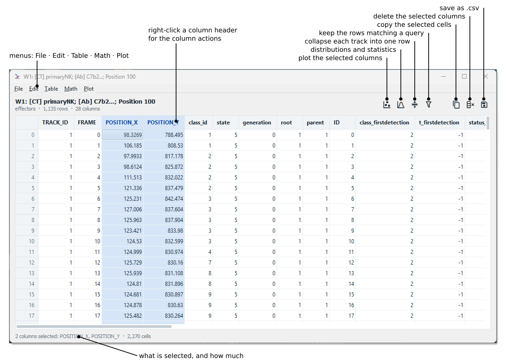
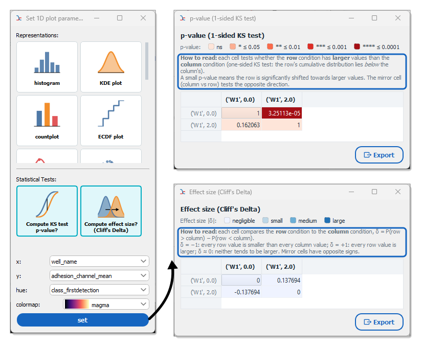

.. _table_exploration:

Table Explorer (Table UI)
=========================

The Table Explorer (internally ``TableUI``) is a powerful interface for interacting with your measurement data. It allows you to visualize data structure, perform calculations, generate plots, and aggregate track information.

Overview
--------

The Table UI provides a spreadsheet-like view of your data with extensive capabilities for data manipulation and visualization. It is accessible from various parts of the application where measurement tables are displayed, for instance with the :icon:`table,#1565c0` :blue:`Explore table` button of a population.

    **The Table Explorer.** The header gives the size of the table and a strip of tools for the most frequent actions; a tool that needs a selection stays disabled, and says why, until columns are selected. The line under the table describes the current selection.

Selecting and acting on columns
-------------------------------

Click a column header to select the column, and :kbd:`Ctrl` + click to add more. The line under the table tells what is selected. Right-click a header for the column actions: plot, copy, rename or delete. Columns can be reordered by dragging their header; the order is kept when the table is saved.

Menu Actions
------------

The menu bar gathers the actions by kind: **File** (save), **Edit** (copy, rename and delete columns), **Table** (query, collapse tracks, group by frames), **Math** (transformations) and **Plot**. The most frequent ones are also tools of the header.

For a complete list of commands (including Keyboard Shortcuts), see the :ref:`Table Explorer Menu Reference <ref_table_explorer_menus>`.

Plotting
--------

The Table UI offers versatile plotting capabilities, in the **Plot** menu:

- **Plot selection...** (:kbd:`Ctrl+P`, :icon:`chart-scatter-plot,black`): plot the selected columns. In a table without tracks, one column opens the 1D plot interface, two columns a scatter plot, more columns a parallel coordinates plot. In a table of tracks, the columns are plotted over time, track by track (see `Time Series / Track Signals`_).
- **Distributions and statistics...** (:kbd:`Ctrl+I`, :icon:`chart-bell-curve,black`): open the 1D plot interface, whatever the selection, to compare the distribution of a measurement between groups.

1D Plotting
~~~~~~~~~~~
The 1D plot interface offers the representations as cards, which can be combined (e.g. a box plot with a strip plot on top), and the statistical tests as cards below them. It supports:

- **Distributions**: Histogram, KDE plot, ECDF plot.
  *Note:* When selecting a Histogram for a binned property (generated via **Math > Bin...**), the bar width is automatically synchronized to match the exact mathematical bin interval with a clear edge separation.
- **Categorical**: Countplot, Swarm plot, Violin plot, Strip plot, Box plot, Boxenplot.
- **Stats**: Option to compute KS test p-values and Cliff's Delta effect size (see `Statistical Analysis`_).
- **Grouping**: Select X, Y, and Hue variables to group data.

2D Plotting
~~~~~~~~~~~
If two columns are selected, a scatter plot is automatically generated comparing the two variables. Select **Histogram** to switch to a co-binning heatmap displaying density distributions, or **KDE plot** to display a smooth 2D density contour map. If the X and Y metrics represent binned properties (via **Math > Bin...**), the generated 2D **Histogram** grid will perfectly align with both interval widths to form true spatial bounding boxes.

Time Series / Track Signals
~~~~~~~~~~~~~~~~~~~~~~~~~~~
When viewing track data, you can visualize signals over time:

- **Plot selection...** (:kbd:`Ctrl+P`) with one column selected plots that measurement over time for every track.
- With two columns selected, it plots one against the other, one line per track (e.g. ``POSITION_X`` against ``POSITION_Y`` to draw the trajectories).

Statistical Analysis
--------------------

The Table UI facilitates pairwise statistical comparisons between groups of data. These tests can be accessed through the **1D Plotting** interface by selecting the corresponding cards. Each test opens a table comparing every pair of groups, with a legend of its colors and a short guide on how to read it. The table can be exported to CSV.

    **Pairwise statistics.** With both test cards selected, **set** opens the p-value and the effect size tables next to the plot. The guides framed in blue tell how a cell compares its row to its column. Here, the adhesion of the cells present from the first frame (``class_firstdetection`` = 2) is compared to that of the cells that arrive during the movie (0): the latter are significantly larger (p ≈ 3·10⁻⁵), but the effect is negligible (δ ≈ 0.14).

The tables are **not symmetric**: each cell compares the **row** group to the **column** group, and the mirror cell compares them the other way round.

Hypothesis Testing (p-value)
~~~~~~~~~~~~~~~~~~~~~~~~~~~~

*   **Test Used**: Two-sample Kolmogorov-Smirnov test (``scipy.stats.ks_2samp``).
*   **Alternative Hypothesis**: ``less``. This explicitly checks if the cumulative distribution function (CDF) of the first group (Row) is *less* than that of the second group (Column).
*   **Interpretation**: In the context of the KS test, CDF(Row) < CDF(Col) implies that the values in the **Row** group are stochastically **larger** than the values in the **Column** group.
*   **Result**: The resulting pivot table displays color-coded p-values:
    *   **ns**: p > 0.05
    *   **\***: p <= 0.05
    *   **\*\***: p <= 0.01
    *   **\*\*\***: p <= 0.001
    *   **\*\*\*\***: p <= 0.0001
    *   *Note*: A significant result (red) means the Row group is significantly larger than the Column group. A non-significant cell does not mean the groups are equal: check the mirror cell, which tests whether the Row group is smaller.

Effect Size (Cliff's Delta)
~~~~~~~~~~~~~~~~~~~~~~~~~~~

*   **Measure Used**: Cliff's Delta (non-parametric).
*   **Interpretation**: Quantifies the amount of difference between two groups, as δ = P(row > column) − P(row < column). It ranges from -1 to 1, where 1 means all values in the **Row** group are larger than the **Column** group, -1 means the opposite, and 0 that neither tends to be larger. Mirror cells have opposite signs.
*   **Color Coding**: The pivot table colors cells based on the **absolute magnitude** of the effect size (\|d\|), using standard thresholds (Romano et al., 2006):
    *   **Negligible**: \|d\| < 0.147
    *   **Small**: 0.147 <= \|d\| < 0.33
    *   **Medium**: 0.33 <= \|d\| < 0.474
    *   **Large**: \|d\| >= 0.474

Track Collapsing
----------------

One of the most powerful features is the ability to aggregate data at the track level. This transforms your data from a **time-series format** (one row per timepoint) to a **track-based format** (one row per cell track). Use **Table > Collapse tracks...** (:kbd:`Ctrl+G`, :icon:`arrow-collapse-vertical,black`) to open the projection mode dialog.

Global Operation
~~~~~~~~~~~~~~~~
Collapse the entire track into a single value using an aggregation function.

- **Operations**: `mean`, `median`, `min`, `max`, `first`, `last`, `prod`, `sum`.
- **Example 1**: You want to know if a cell *ever* expressed a marker. Use **max** on the intensity column.
- **Example 2**: You want to correlate cell size with fate. Use **mean** on the ``area`` column to get the average size of the cell over its lifetime.

@ Event Time
~~~~~~~~~~~~
Extract measurement values at a specific event time. This is useful for synchronizing data around biological events.

- **Prerequisite**: Your table must contain event times (columns starting with ``t_`` or ``t0``), typically generated by the *Event Detection* or *Event Annotation* modules.
- **Example**: "What was the cell's nuclear circularity **at the moment of division**?". Select ``@ t0`` (or your specific event column). The resulting table will contain the value of ``circularity`` at the frame corresponding to that event for each cell.

Per Status
~~~~~~~~~~
Aggregate measurements independently for each cell state or status.

- **Prerequisite**: Your table must contain status or classification columns (starting with ``status_`` or ``group_``).
- **Example**: Compare protein localization during the cell cycle.
    - If you have a ``status_cell_cycle`` column (with values like G1, S, G2), selecting this option with **mean** will create separate columns for each phase (e.g., ``mean_intensity_G1``, ``mean_intensity_S``).
    - You can then easily plot these against each other to see stage-specific differences.

