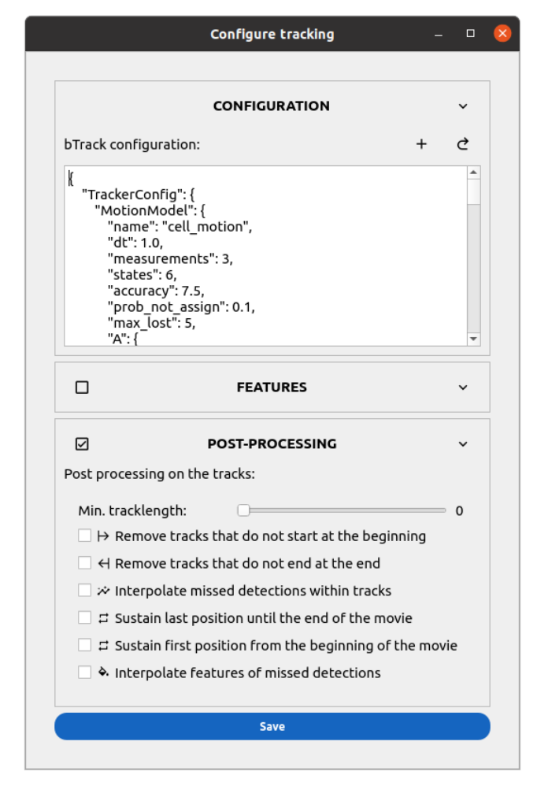
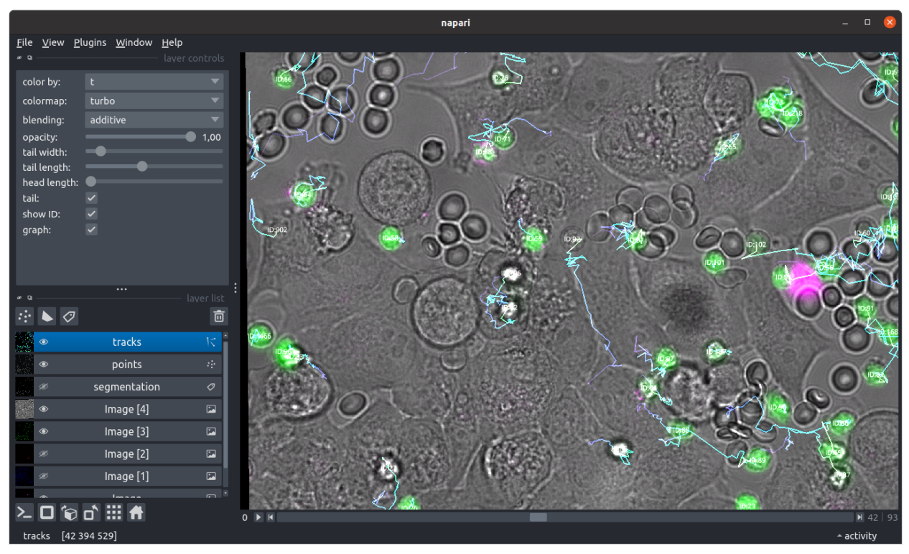

Track
=====

.. _track:

Prerequisite
------------

You must segment the cells prior to tracking.

I/O
---

This modules takes the instance segmentation label images, the original microscopy images (if you asked for feature measurements) and outputs a trajectory table where each line represents a cell at a given timepoint.

Adapt the tracker to your cells
-------------------------------

After segmentation, tracking attributes a unique identity to each cell throughout the movie. Celldetective supports two tracking engines: **bTrack** (default, advanced) and **trackpy** (simple, Brownian motion).

Click the **Settings** button in the Tracking module to configure the pipeline.

1. Tracker Selection
~~~~~~~~~~~~~~~~~~~~

*   **bTrack** [#]_: A Bayesian tracker that uses both motion prediction (Kalman filter) and visual features to link detections. It is best for complex cell behaviors (division, apoptosis) and crowded environments.
*   **trackpy**: A particle-tracking algorithm based on Crocker-Grier. Best for simple Brownian motion.
    *   **Search range [px]**: Maximum distance a cell can move between frames.
    *   **Memory [frames]**: Number of frames a particle can "disappear" and still be linked if it reappears.

2. Feature Extraction
~~~~~~~~~~~~~~~~~~~~~

You can extract morphological and intensity features during tracking.
For a complete list of available features and settings (including Haralick texture parameters), see the :ref:`Tracking Settings Reference <ref_tracking_settings>`.

3. Post-Processing
~~~~~~~~~~~~~~~~~~

Clean up trajectories before saving. Options include filtering by track length, filling gaps, and cleaning start/end artifacts.
See the :ref:`Post-Processing Reference <ref_tracking_settings>` for details.

    
    **GUI to configure the tracking parameters.**

**Execution**

Once configured, click **Save**. Tick the ``TRACK`` option in the control panel and click **Submit**. Celldetective will process the movie, extract features, run the tracker, and save a ``.csv`` file in ``output/tables``.

Visualization
-------------

Once the tracking step is complete, you can view the tracks (neglecting the positions not associated with a cell mask) by clicking on the eye button in the tracking module (select a single position first). 

    
    **View tracks in napari**

Upon running the function, Napari launches with the following layers:

* ``image``: Displays the raw image stack.
* ``segmentation``: Shows the labeled masks with cell IDs.
* ``points``: Highlights key positions for each cell.
* ``tracks``: Visualizes trajectories across frames.

Modifying Tracks
----------------

You can interact with the ``segmentation`` layer to modify trajectories. Here's how:

#. **Selecting a Cell**:  Use the pipette tool in the segmentation layer to select a cell's mask value, just before a tracking mistake. Select the move image button. Navigate to the next frame using Napari's timeline slider.
#. **Reassigning a Track**: in the later frame, double-click on the target cell to change its value to the one selected with the pipette. A confirmation dialog will appear: click Yes to assign the selected track ID to the cell under the cursor. The software will propagate the new track ID to all later frames. Any conflicting track IDs are automatically reassigned to maintain data integrity.
#. **Visualization Updates**: The tracks layer updates dynamically, reflecting the changes.
``points`` and ``segmentation`` layers refresh to show the adjustments.
#. **Exporting Modifications**: Once you’ve completed your edits, save the updated tracks to the dataset. In napari’s right dock, find the ``Export the modified tracks...`` button.
Click it to: 1) save the updated track data to the original CSV file and 2) apply any configured post-processing options, such as velocity calculations or trajectory cleanup.

References
----------

.. [#] Ulicna, K., Vallardi, G., Charras, G. & Lowe, A. R. Automated Deep Lineage Tree Analysis Using a Bayesian Single Cell Tracking Approach. Frontiers in Computer Science 3, (2021).
